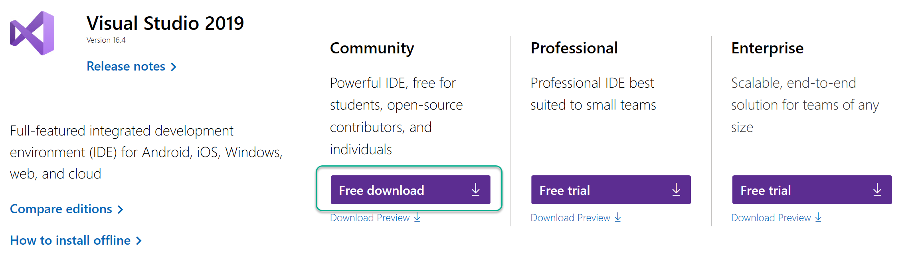
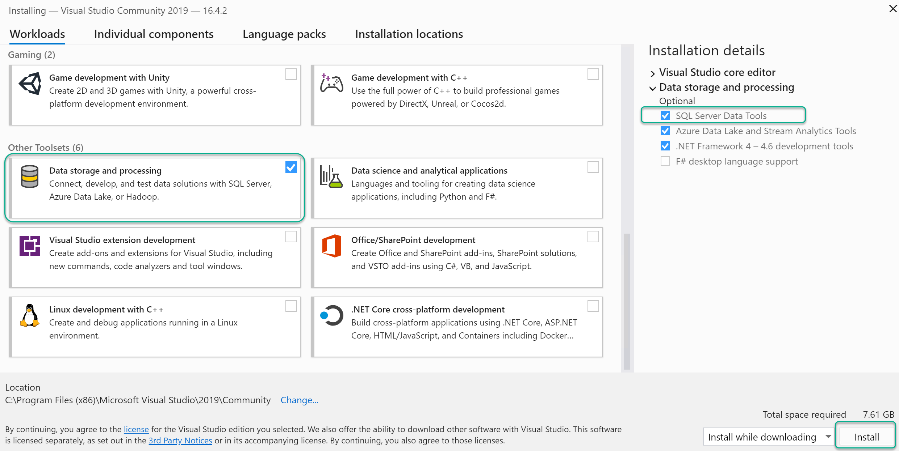
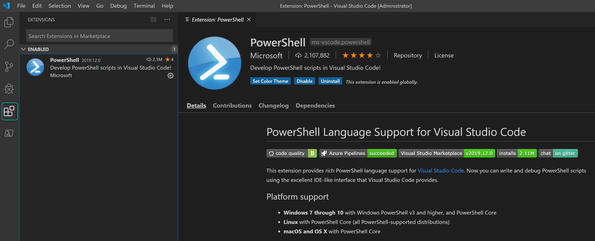
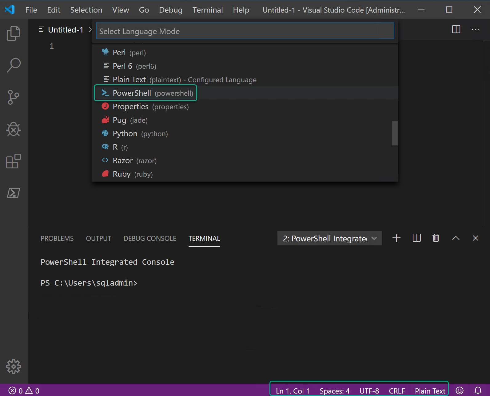
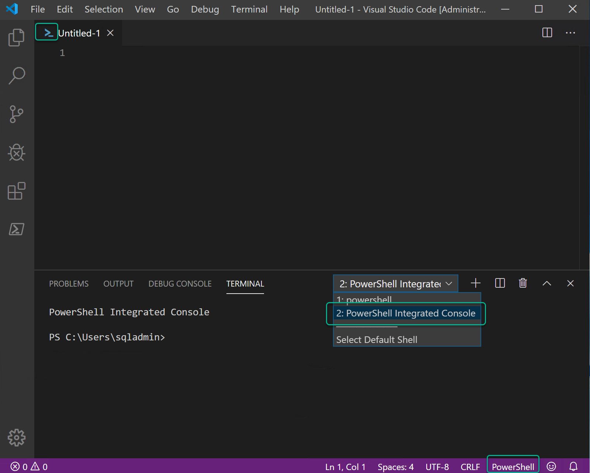
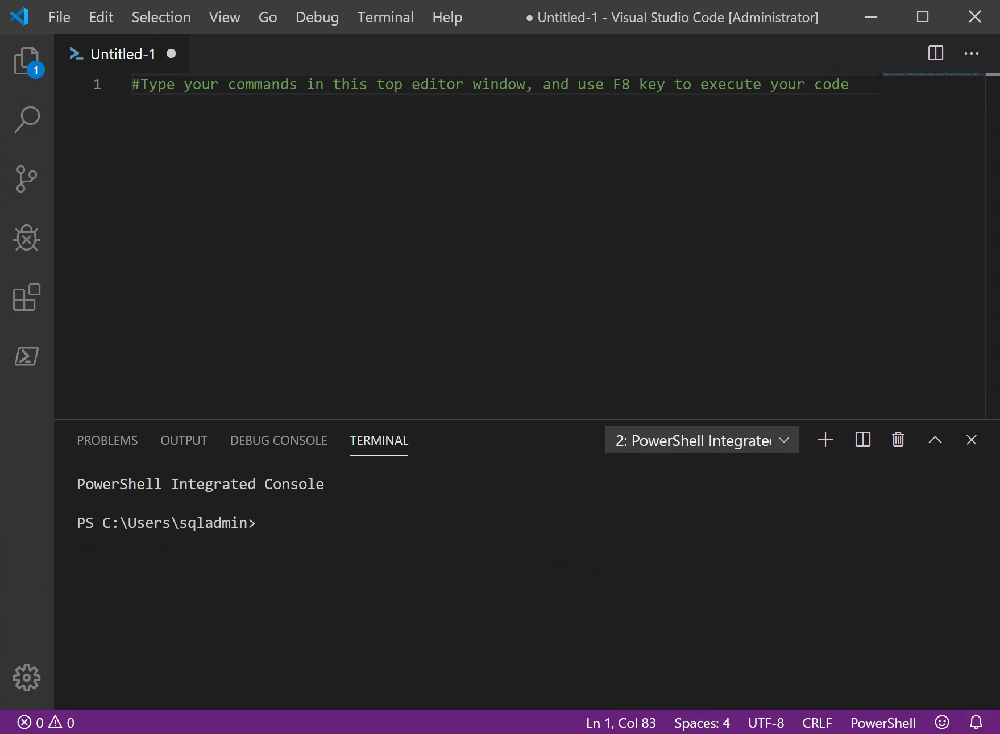

## Lab 1 - Configure your Local Environment
[Back to all modules](/docs/labs/README.md)
--------------------------------

| Lab Description | This lab covers the installation of tools that you will you in the labs. |
| :------------ | :-------------- |
| Estimated Time to Complete | 30 minutes |
| Key Takeaways | 1. Download and install the required tools |
|  | 2. Know what version of the tools are installed |
|  | By the end of this lab, you should have: Git, Visual Studio - SSDT, Visual Studio Code, Azure PowerShell, SSMS, Azure Data Studio, SQLPackage.exe |
| Author | Frank Garofalo |

### Purpose

For those new to DevOps, Source Control, and Database Projects
there are many tools that you need to familiarize yourself with. This modules
walks you through installing and configuring the required tools for this lab, as well as making sure they are on the current supported versions.

## <div style="color: #107c10">Exercise - Setup Az PowerShell Module</div>

### Launch PowerShell

1.  Right Click on **Windows PowerShell** from either the Desktop or the
    Start Menu

2.  Select **Run as Administrator**

### Set PowerShell Execution Policy

1.  Run the following PowerShell Command to set your execution policy to
    Unrestricted:

```powershell
Set-ExecutionPolicy Unrestricted
```

2.  Select Yes if prompted. Execution policies determine whether you can
    load configuration files, such as your PowerShell profile, or run
    scripts and whether scripts must be digitally signed before they are
    run. More information on this topic can be found here:
    <https://docs.microsoft.com/en-us/powershell/module/microsoft.powershell.security/set-executionpolicy?view=powershell-6#parameters>

### Install Az Module

1.  Run the following PowerShell Command:

```powershell
Install-Module -Name 'Az'
```

2.  If not already installed, you may be prompted to install the NuGet
    provider. Select **Yes** if this is the case.

3.  You may receive a warning message stating you are installing modules
    from an untrusted repository. Select **Yes** if this is the case.
    This process may take several minutes.

4.  Run the following PowerShell Command to verify the module has
    installed correctly:

```powershell
Get-Module -Name '*Az*' -ListAvailable
```

5.  If installed, Az should be returned

6.  Run the following PowerShell Command to turn off autosaving Azure
    credentials\
    (some Azure PowerShell versions have this on as the default)

```powershell
Disable-AzContextAutosave
```

Expected return:

> PS C:\\\> Disable-AzContextAutosave
>
> Mode : Process
>
> ContextDirectory :
>
> ContextFile :
>
> CacheDirectory :
>
> CacheFile :
>
> Settings : {}

## <div style="color: #107c10">Exercise - Setup  Git for Windows</div>
### Download Git for Windows Installation Files

1.  In a web browser, navigate to <https://git-scm.com/download/win>

2.  The 64-bit version of **Git for Windows** should begin automatically
    downloading, if it does not select **64-bit Git for Windows Setup**

3.  Note the location of the installation files

###  Install Git for Windows

1.  Run the **Git for Windows** installation file

2.  Accept the EULA by clicking **Next**

3.  Accept the default Destination Location and click **Next**

4.  Accept the default Components and click **Next**

5.  Accept the default Start Menu Folder of "Git" and click **Next**

6.  Accept the default editor of Vim and click **Next**

7.  Accept the default "Git from the command line and also from
    3rd-party software" and click **Next**

8.  Accept **OpenSSL** as the default HTTPS transport backend and click
    **Next**

9.  Accept the default **Windows-style** "Configuring the line ending
    conversions" and click **Next**

10. Accept the default **MinTTY** terminal emulator and click **Next**

11. Accept the default Configuring extra options and click **Next**

12. Click **Install**

13. Uncheck "View Release Notes" and click **Finish**

## <div style="color: #107c10">Exercise - Setup  Visual Studio Code</div>

### Download Visual Studio Code

1.  In a web browser, navigate to <https://code.visualstudio.com>

2.  Click **Download for Windows**

3.  Note the location of the installation files

### Install Visual Studio Code

1.  Run the **VSCodeUserSetup** installation file

2.  If you are prompted with a message \"This User Installer is not
    meant to be run as an Administrator\" Click **OK**

3.  Accept the EULA and click **Next**

4.  Accept the default installation location and click **Next**

5.  Accept the default Start Menu Folder and click **Next**

6.  Select all additional tasks and click **Next** (Optional)

7.  Click **Install**

8.  Uncheck "Launch Visual Studio Code" and click **Finish**


## <div style="color: #107c10">Exercise - Setup  Visual Studio - SSDT</div>

### Download Visual Studio 2019

1.  In a web browser, navigate to <https://visualstudio.microsoft.com/downloads/>

2.  Click Free Download on Community Edition</br>
*if you have a license, download the appropriate edition*</br>



1. Note the location of the installation files

### Install Visual Studio 2019

1. Run the **vs_community** installation file

2. Accept the EULA and click Next

3. Select the Data storage and processing workload

4. Make sure SQL Server Data Tools is selected

5. Click Install </br>
*This is a large install and can take some time to complete*</br>   
 

## <div style="color: #107c10"> Exercise - Setup Sql Server management studio (SSMS) </div>
*`SSMS is not required for this lab, but is useful to connect to and query Azure SQL Database with.`*

### Download SSMS

1. In a web browser, navigate to <https://aka.ms/ssmsfullsetup>

2. Note the location of the installation file

### Install SSMS

1. Run the **SSMS-Setup-ENU** installation file

2. Leave defualt installation path

3. Click Install

4. Once Setup completes click **Close**

## <div style="color: #107c10"> Exercise - Setup  Azure Data Studio </div>
*`SSMS is not required for this lab, but is useful to connect to and query Azure SQL Database with.`*

### Download Azure Data Studio

1. In a web browser, navigate to <https://go.microsoft.com/fwlink/?linkid=2113530>
   
2. Note the location of the installation file

### Install Azure Data Studio
1.  Run the **azuredatastudio-windows-user-setup** installation file

2.  If you are prompted with a message \"This User Installer is not
    meant to be run as an Administrator\" Click **OK**
    
3. Accept the EULA and click **Next**

4.  Accept the default installation location and click **Next**

5.  Accept the default Start Menu Folder and click **Next**

6.  Select all additional tasks and click **Next** (Optional)

7.  Click **Install**

8.  Uncheck "Launch Azure Data Studio" and click **Finish**

## <div style="color: #107c10">Exercise - Version Check and Configuration</div>

### Check the version of Az

1.  Launch VS Code

2.  Select the terminal. This is typically in the lower right pane of VS
    Code and is often tabbed with other panes, such as Problems, Output,
    and Debug Console. If you do not see Terminal, click View in the top
    menu bar and click **Terminal**.

3.  Type the following PowerShell command:

```powershell
Get-Module -Name 'Az.Compute' -ListAvailable | Select-Object -Property 'Version'
```

4.  The expected output is **3.3.0** or later

### Check the version of Git for Window

1.  From within the VS Code Terminal, Type the following git command:

```powershell
git --version
```

2.  The expected output is **git version 2.24.1.windows.2** or later

3.  If you experience any issues with this step, restart VS Code and try
    again

### Check the version of Visual Studio Code

1.  From the VS Code File Menu, click **Help** then **About**

2.  The expected version is **1.41.1** or later
   
### Install extensions in Visual Studio Code
*Credit for this exercise goes to: [Azure Superpowers](https://github.com/microsoft/AzureSuperpowers/blob/master/docs/AzureSuperpowers.md#exercise---vs-code-interface "Azure Superpowers")*
1.  Visual Studio Code has a rich extensibility model for interacting
    with and adding to the tool. The features that Visual Studio Code
    includes out-of-the-box are just the start. VS Code extensions let
    you add languages, debuggers, and tools to your installation to
    support your development workflow.

2.  You may find an extension for Azure Repos. We do not recommend using
    this extension in this workshop. If you already have this extension
    installed, please remove it for the duration of this workshop.

3.  Search for and install the following extension, published by
    Microsoft. Once the extension is installed, reload VS Code.

        a.  PowerShell (In addition to enhancements to PowerShell, this
        extension includes a PowerShell ISE color theme that can found
        by selecting File, Preferences, Color Theme)
        b.  Install the latest available version of the PowerShell
        extension, which may be newer than the version shown below.

    

4.  You will not need any other VS Code extensions for this course. You
    may find extensions that attempt to connect you into Git
    repositories in Azure DevOps, but they are not needed and have been
    found to cause confusion with future steps in this workshop.

5.  In VS Code, the language support for a file is based on its filename
    extension. However, at times you may wish to change language modes
    when working in a particular file. To do this, while editing a file,
    click on the language indicator - which is located at the bottom of
    the VS Code window on the right hand of the Status Bar. This will
    bring up the Select Language Mode drop-down where you can select
    another language for the current file you are working on.

    

    

6.  Regarding PowerShell authoring in VS Code, you will want to have the
    PowerShell extension installed. You will also want to ensure that
    when you are working with PowerShell code, you have the VS Code
    language set to PowerShell, and you will want to use the PowerShell
    Integrated Console. **You will need have at least one PowerShell file
    open in VS Code for the PowerShell Integrated Console to appear.**

    

7.  Operating in this configuration will provide you with the best
    PowerShell experience, and enable familiar options from the
    PowerShell ISE, such as pressing F8 to execute a selected area of
    code.

8.  **NOTE:** When it comes to authoring PowerShell code in this course,
    we recommend that you type your commands in the top editor window,
    and use the F8 key to execute your code. Typing your code in the
    editor window allows you to save the commands you type throughout
    this course so you can easily refer to them later. The top editor
    window also enables you to be able to select and execute multiple
    lines of PowerShell.

    

## <div style="color: #ffb900">Troubleshooting</div>

**Azure PowerShell**\
\
We have seen issues in previous workshops if a system has multiple
versions of the Azure PowerShell module installed. If you run into
module related issues, remove **all Azure modules** from\
C:\\Program Files\\WindowsPowerShell\\Modules and install the Azure
module again.

While it is technically possible to have both the Az and AzureRM
PowerShell modules installed, we recommend removing the AzureRM modules
and using only the Az modules.

The Az PowerShell module requires .Net Framework Runtime 4.7.2 or higher

**Azure subscriptions**

<ins>TRIAL SUBSCRIPTIONS ARE NOT SUPPORTED FOR THIS WORKSHOP</ins>

[Back to all modules](/docs/labs/README.md)