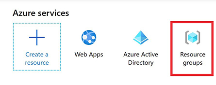

## Lab 2 - Configure your DevOps Environment
--------------------------------

[Back to all modules](/docs/labs/README.md)


| Lab Description | This lab covers the configurations and environment creation for DevOps deployments. |
| :------------ | :-------------- |
| Estimated Time to Complete | 30 minutes |
| Key Takeaways | 1. Create resources in Azure necessary for deployment automation |
|  | 2. Establish RBAC permissions for resource creation |
|  | 3. Set up permissions and service principals for continious deployments in Azure DevOps environment |
|  | By the end of this lab, you should have: Resource Groups, Service Principal, ARM Templates, Azure DevOps Environment
| Author | Shirley MacKay|


### Purpose

This lab will create the environment for the CI/CD process. Service Principals are leveraged to allow permission to deploy or update resources in a certain environment for a specific purpose. The Service Connections are based off the Service Principals permissions that is limited to what is required for updates and deployments of the resources. It gives Administrators better control over their environment while allowing the engineers to have concern with only their code.
 
 **Summary**
  * [Setup Up Azure Environment](#exercise---setup-azure-environment)
  * [Azure AD Service Principles](#exercise---setup-permissions)

## <div style="color: #107c10">Exercise - Setup Azure Environment</div>

### Create Azure Resource groups(Portal or PowerShell)

#### Portal

1. Login to **https://portal.azure.com**
1. Select **Resource Groups** from the main menu



1. Click **Add**
   - Select the **Subscription**
   - Enter the **Resource Group** name
   - Select the **Region**
   - Click **Review + create**
   - Click **Create**

#### PowerShell

```powershell  
$rg = "<Your Resource Group Name>"
$location = "<Location>"

Login-AzAccount

Select-AzSubscription –Subscription '<Id>'
New-AzResourceGroup -Name $rg -Location $location
Get-AzResourceGroup -Name $rg
``` 

>**Note:** Use the following cmdlets to obtain the subscription id and regions `
```powershell  
Get-AzSubscription
Get-AzLocation
``` 


### Create Service Principal

1.  [Work in Progress]

```powershell
Set-ExecutionPolicy Unrestricted
```

## <div style="color: #107c10">Exercise - Setup Permissions</div>

### Access Control (IAM)

1.  [Work in Progress]

### DevOps Service Connection with Azure Resource Manager

1.  [Work in Progress]


## <div style="color: #107c10">Exercise - Clone Project Repro</div>
### Set up Azure DevOps environment

1.  [Work in Progress]

   
### Install extensions in Visual Studio Code
*Credit for this exercise goes to: [Azure Superpowers](https://github.com/microsoft/AzureSuperpowers/blob/master/docs/AzureSuperpowers.md#exercise---vs-code-interface "Azure Superpowers")*

**Azure subscriptions**

<ins>TRIAL SUBSCRIPTIONS ARE NOT SUPPORTED FOR THIS WORKSHOP</ins>

[Back to all modules](/docs/labs/README.md)

