## Lab 2 - Configure your DevOps Environment
--------------------------------

[Back to all modules](/docs/labs/README.md)

| Lab Description | This lab covers the configurations and environment creation for DevOps deployments. |
| :------------ | :-------------- |
| Estimated Time to Complete | 20 minutes |
| Key Takeaways | 1. Create resource group in Azure  for deployment automation |
|  | 2. Establish RBAC permissions for resource creation |
|  | 3. Setup permissions and service principals for continuous deployments in Azure DevOps environment |
|  | By the end of this lab, you should have: Resource Groups, Service Principal, Azure DevOps Environment, Artifacts needed to complete this workshop
| Author | Shirley MacKay </br> Frank Garofalo|

### Purpose

This lab will create the environment for the CI/CD process. Service Principals are leveraged to allow permission to deploy or update resources in certain environments for a specific purpose. The Service Connection uses a Service Principal's permissions which are based off of RBAC. It gives Administrators better control over their environment while allowing the engineers the ability to focus on their code.
 
 **Summary**
  * [Setup Up Azure Environment](#exercise---setup-azure-environment)
  * [Azure AD Service Principal](#exercise---setup-permissions)
  * [Setup Azure DevOps Environment](#exercise---set-up-azure-devops-environment)
  * [Push files to your Azure DevOps Repo](#exercise---push-files-to-your-repo)

## <div style="color: #107c10">Exercise - Setup Azure Environment</div>

### Create Azure Resource groups

```diff 
# Perform the tasks below either via the Portal or PowerShell.
# Create two Resource groups one for Dev and one for Prod
# Example naming convention: <name>-prod, <name>-dev
```

> #### **Portal**
1. Login to **https://portal.azure.com**
2. Select **Resource Groups** from the main menu


**create two resource groups:** </br>
         SuperchargeSQL-dev</br>
         SuperchargeSQL-prod</br>
        
1. Click **+ Add**
   1. Select the **Subscription**
   2. Enter the **Resource Group** name *(example: sqldb-dev)*
   3. Select the **Region**
   4. Click **Review + create**
   5. Click **Create**

> #### **PowerShell**
**create two resource groups:** </br>
         SuperchargeSQL-dev</br>
         SuperchargeSQL-prod</br>

```powershell  
$rg = "<Your Resource Group Name>" #Use: SuperchargeSQL-dev & SuperchargeSQL-prod
$location = "<Location>"

Login-AzAccount
#For Azure Government use:  
#Login-AzAccount -Environment AzureUSGovernment

Select-AzSubscription –Subscription '<Id>'
New-AzResourceGroup -Name $rg -Location $location
Get-AzResourceGroup -Name $rg
``` 

:bulb: Use the following cmdlets to obtain the subscription id and region
```powershell  
Get-AzSubscription
Get-AzLocation
``` 


### Create Service Principal

```diff 
# Perform the tasks below either via the Portal or PowerShell.
```

> #### **Portal**

1. Login to **https://portal.azure.com**
2. Select **Azure Active Directory** from the main menu </br>
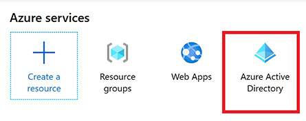

3. Select the **App Registrations** blade
4. Select **+ New registration**
   1. Enter the **Name**: **\<your alias>-SuperchargeSQL-SP** 
   1. Leave the defaults
   1. Click **Register**

On the **App Registrations > <Your App Name>** blade
 
 1. Select the **Certificates & secrets** blade
	   1. Select the **+ New client secret** 
	   1. Enter the **Description**
	   1. Click **Add**
	   1. Copy the **Value**

:exclamation: Be sure to save the secret somewhere for later on, you can only view it upon creation

> #### **PowerShell**
```powershell  
Login-AzAccount
#For Azure Government use:  
#Login-AzAccount -Environment AzureUSGovernment

Select-AzSubscription –Subscription '<Id>'

$spName  = '<your alias>-SuperchargeSQL-SP'
$id = (New-Guid).Guid
$pass = (New-Guid).Guid

$cred = New-Object Microsoft.Azure.Commands.ActiveDirectory.PSADPasswordCredential
$cred.StartDate = Get-Date
$cred.EndDate = (Get-Date).AddYears(1)
$cred.KeyId = $id
$cred.Password = $pass
New-AzADServicePrincipal -DisplayName $spName -PasswordCredential $cred

$pass
``` 

:exclamation: Copy and save the Service Principal Name, ApplicationId and the Key which is the value from the $pass variable. Be sure to save these values as they will be used later.  **The secret can only be viewed at creation.**  If you do not save it you will need to create a new secret later. 


## <div style="color: #107c10">Exercise - Setup Permissions</div>

### Access Control (IAM) for the Resource Group
```diff 
# Perform the tasks below either via the Portal or PowerShell.
```
> #### **Portal**

Go to both of your new resource groups that you created earlier
1. Click on the **Access control (IAM)** blade
2. Click on **+ Add**
3. Click on **Add role assignment**
     1. Select the **Owner** role
     2. Enter your Service Principal name in the **Select** box to search
     3. Click **Save**
4. Click on **Role Assignments** to verify

> #### **PowerShell**
```powershell  
Login-AzAccount
#For Azure Government use:  
#Login-AzAccount -Environment AzureUSGovernment

Select-AzSubscription –Subscription '<Id>'

$spName  = '<Service Principal Name>'
$rg = "<Your Resource Group Name>"

$app = (Get-AzADServicePrincipal -DisplayName $spName).ApplicationID
New-AzRoleAssignment -ApplicationID $app -ResourceGroupName $rg -RoleDefinitionName 'Owner'
``` 

## <div style="color: #107c10">Exercise - Setup Azure DevOps Environment</div>


#### Azure DevOps Organizations

1. Sign in **https://dev.azure.com/**
2. Navigate to Azure DevOps after signing in
3. Click on **New Organization**
     1. Confirm and Enter an **organization** name
         *  The organization name is a DNS name therefor it must be globally unique.  
     2. Choose a **Location**
4. After creation, navigate to your organization **https://dev.azure.com/{yourorganization}**


#### Azure DevOps Project - Clone Project Repo
1. Enter your **Project name**
2. Enter Description (optional)
3. Select **Private**
4. Expand the Advanced options
5. Select **Git** and **Basic** for version control and work item process, respectively. 
6. Click on **+ Create project**

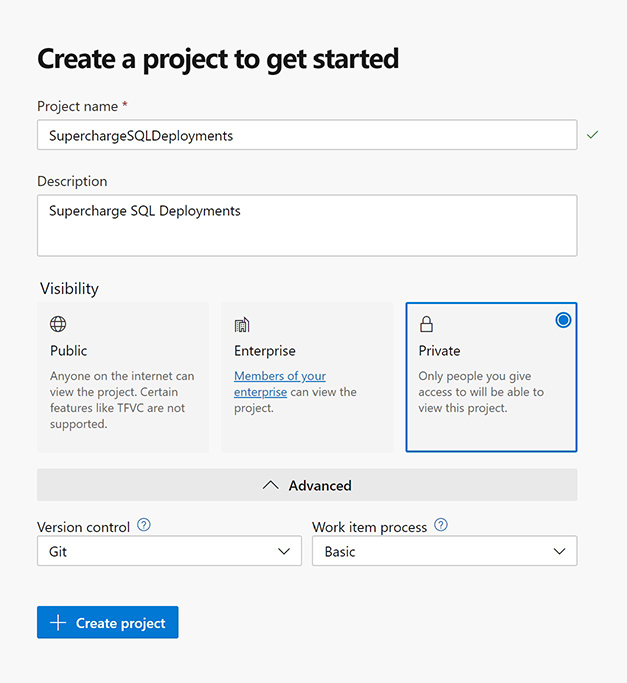

1. Click on **Repo**

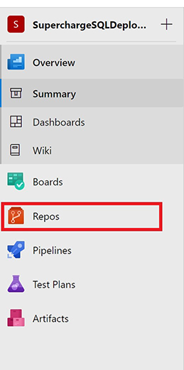

1. Click on **Initialize**</br>
*Defult settings to include Add a README*
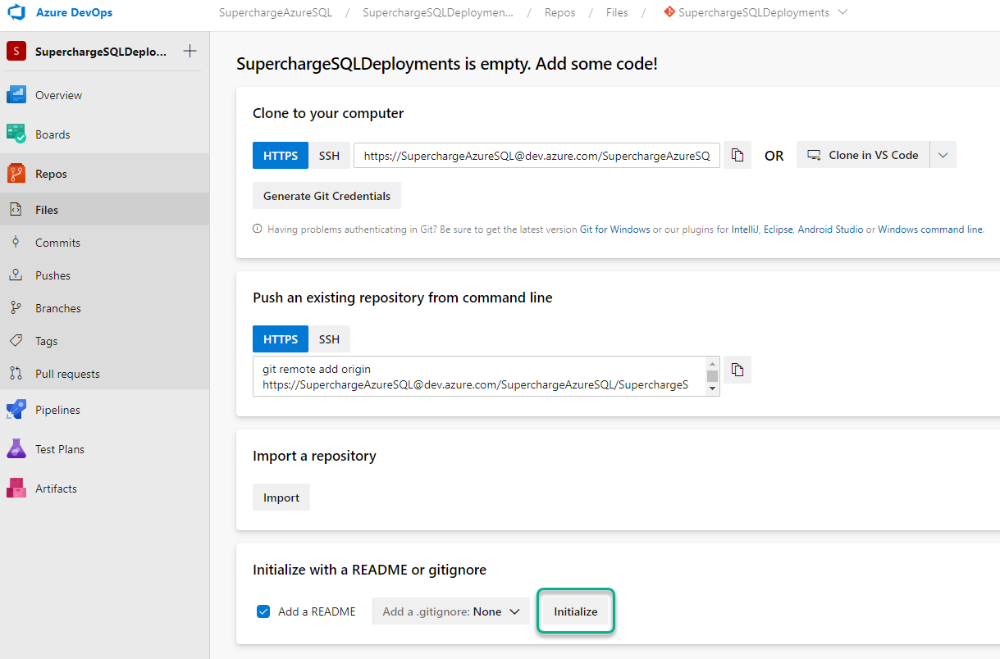

## Branching
There are many options for a branching strategy and Git gives you the flexibility in how you use version control to share and manage code.  It's an important part of DevOps and your strategy is something that your team should come up with.  For more information about branching strategies please review [Adopt a Git branching stategy](https://docs.microsoft.com/en-us/azure/devops/repos/git/git-branching-guidance?view=azure-devops) docs page. For this workshop we are going to work with just a *dev* and *master* branch.

1. Click on Repos to expand the **Repos** sub menu
2. Click on sub menu **Branches**</br>
     *Notice that your Repo only has a **master** branch, by default new Git Repos only have a **master** branch*</br>

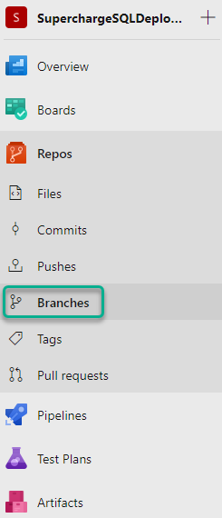

3. Click **New branch** 
4. Enter Name: **dev**
5. Click **Create**
6. Click on the ellipse on the **master** branch to expose more options
7. Click **Branch policies**
   


8. You are now going to set a policy to Protect your **master** branch</br>
*This is to keep people from accidentally checking dev code into master/prod branch*
1. Select **Require a minimum number of reviewers**
2.  Change the minimum number of reviewers to **1**
3.  Select **Requestors can approve their own changes**
4.  Save changes

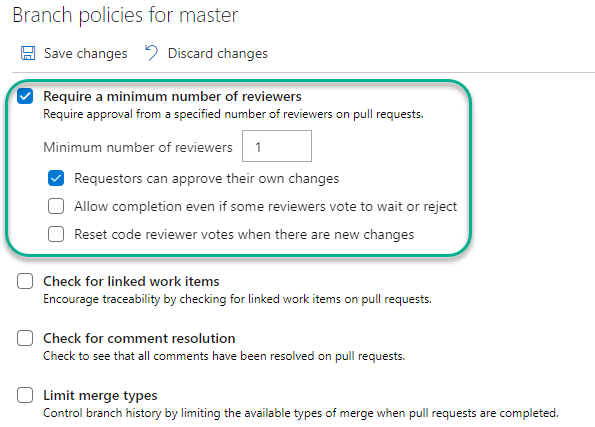

1. Click on **Branches**
2. Notice that your master branch, now has a Branch Policy icon on it. 

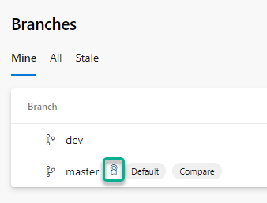

## DevOps Service Connection with Azure Resource Manager

1. Select the **Project Settings**

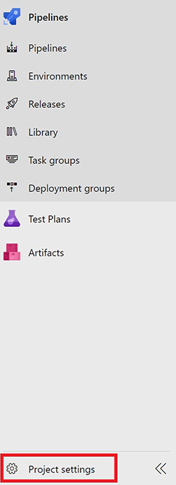

2. Select **Service Connections** under **Pipelines**
3. Click on **Create service connection**
4. Select **Azure Resource Manager**

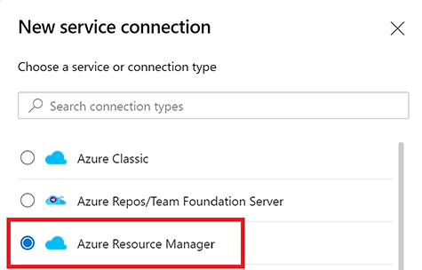

1. Click on **Next**
2. Select **Service principal (manual)**

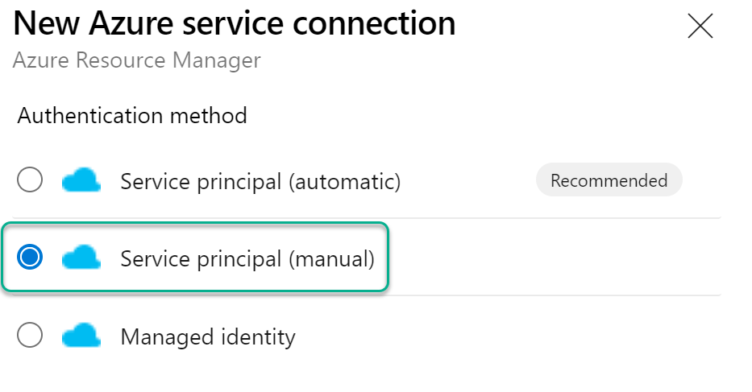</br>

>  If you do not use manual, Azure DevOps will attempt to use your currently logged in Azure DevOps credentials to create a new Service Principal and give it rights to the subscription, instead of using the one we just created.

Enter the following:
1. Select Environment
2. Select Scope level **Subscription**
3. Enter **Subscription Id**</br>
     ```PowerShell
     Get-AzSubscription
     #Returns Subscription Name, Id, TenantId and State
    ```
4. Enter **Subscription Name**
5. Enter **Service Principal ID** (Created earlier)
6. Select Credential **Service principal key**
7. Enter **Service principal key** (Value noted earlier)
8. Tenant ID should be pre-populated
9. Click on **Verify**
10. Enter **Service connection name**
11. Enter **Description** (optional)
12. Click on **Verify and save**

## <div style="color: #107c10">Exercise - Push files to your Repo</div>
Your repository is currently empty, except for the default README.md file that was created to initialize your repo. In this exercise you are going to use Git commands to clone down the source files needed for this lab and push them up to your repo.  

1. Using the TERMINAL in VSCode or Git Bash
2. Run the following Git command to clone this Github Repo</br>

```Bash

git clone https://github.com/microsoft/SuperchargeAzureSQLDeployments.git c:/SuperchargeAzureSQL

```
3. In a browser navagate to your Azure DevOps Project that you created above.
   1. Click on **Repos**
   2. Click **Files**
   3. Click the **Clone** button

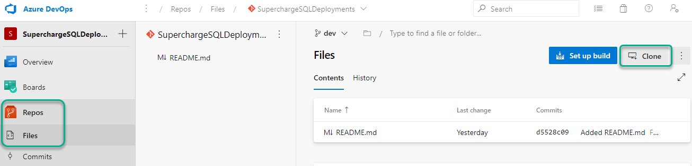</br>

1. Copy the Command line **HTTPS** URL for your repo by clicking on the copy icon

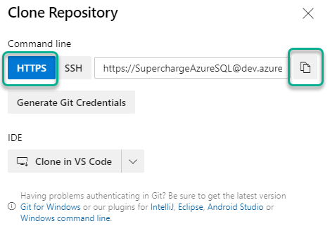

2. Back in VS Code hit the F1 key to open the command pallet
3. Type **Git: Clone** and hit enter
4. Paste the Repository URL for your Azure DevOps Repo
5. Navigate to your **C:\\** drive
6. CLick **Select Repository Location**
   1.  You may be asked to provide your Microsoft account
   2.  Use your Microsoft account used to login to Azure DevOps
7.  Using windows explore navigate to the the **source** directory in the cloned GitHub repo
    *  **C:\\SuperchargeAzureSQL\\source\\** </br>

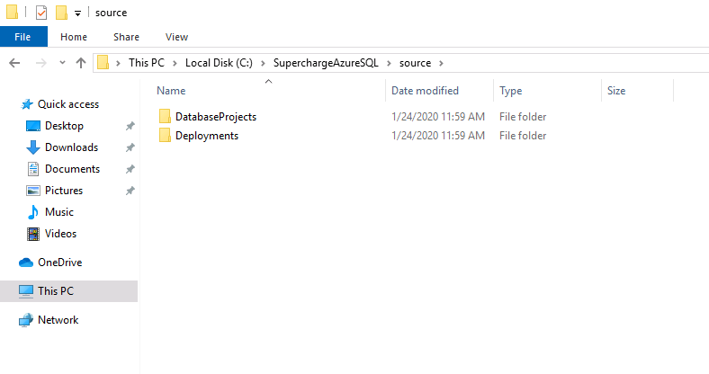

8.  Copy both directories:  DatabaseProjects & Deployments
9.  Using windows explore navigate to your cloned Azure DevOps repo
    *  **C:\\SuperchargeSQLDeployment** </br>
10. Paste the copied directories from step 11 into your cloned Azure DevOps repo
11. The above steps should result with the following:

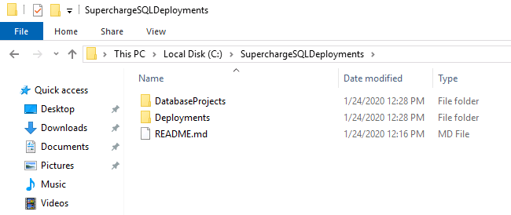

## Performing your initial Commit using VS Code

1. In VS Code from the menu click **File** > **Open Folder** 
2. Navigate to your Cloned Azure DevOps Repo: **C:\SuperchargeSQLDeployments**
3. Click on the Git icon from the left side menu
   1. Notice that is shows a number on the icon
   2. This is the number file files that have not been committed to your local Git repository for your Azure DevOps project
4. Make sure your our working off of the Dev branch
   1. Click on **master** from the bottom left of VS Code</br>

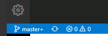

   2. Select **dev**</br>


   3. You should now be in your *dev* branch</br>

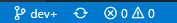

5. Click on the + that shows up when you hover over **CHANGES**
   * This will **stage** all changes in your repo to be committed
   * You can also pick and choose which files you want to stage, for this workshop we want all of the initial files staged to be committed</br>

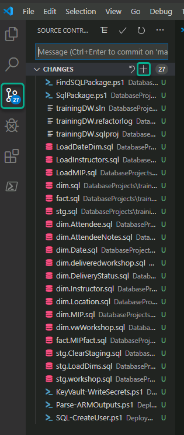

6. Type a message for the initial commit in the **Message** box (ie. initial commit)
7. Click the Check mark to perform the commit.
  >If you receive an error message **Make sure you configure your 'user.name' and 'user.email' in git.** Click Cancel on the error message </br>
  > 1. Open the Terminal in VS Code
  > 2. Run the following commands, **filling in your own name and email address**
  ><br/>
  >git config --global user.name "Your Name" <br/>
  >git config --global user.email "you@example.com" <br/>
  >
  > 3. Run your commit again (Step 6.)
7. You now have commited all of the changes to your local Git Repo, notice that the Git icon in the left side menu does not show any numbers. 
8. Notice that you have changes to push up to your remote Git repo (Azure DevOps Repo</br>


1. Click on the **sync** icon in the bottom left to perform a Git pull & Git push
     * You can also run the following Git command
     >git push
2.  Using a browser navigate to your Azure DevOps project
3.  Click on **Repos** > **Files**
4.  You should now see all of the files in your repo<br/>

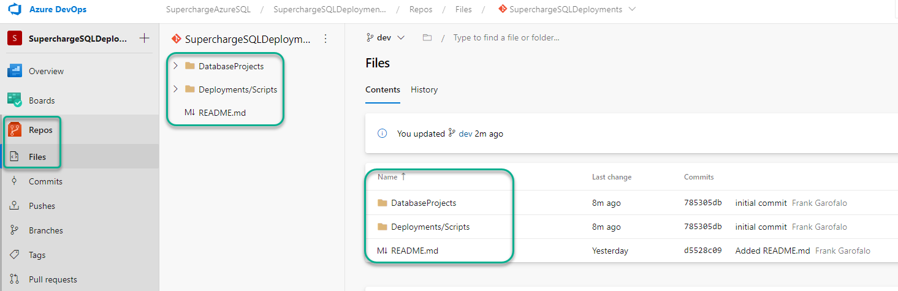
___     
- [Next Lab](/docs/labs/3-AzureResourceDeployment.md)
- [Back to all modules](/docs/labs/README.md)
___
___
**Azure subscriptions**

<ins>TRIAL SUBSCRIPTIONS ARE NOT SUPPORTED FOR THIS WORKSHOP</ins>