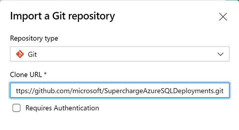
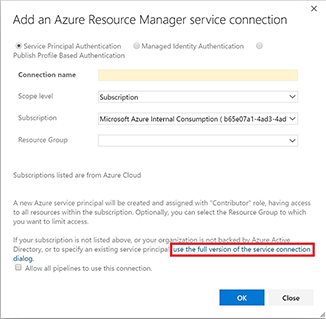

## Lab 2 - Configure your DevOps Environment
--------------------------------

[Back to all modules](/docs/labs/README.md)


| Lab Description | This lab covers the configurations and environment creation for DevOps deployments. |
| :------------ | :-------------- |
| Estimated Time to Complete | 30 minutes |
| Key Takeaways | 1. Create resources in Azure necessary for deployment automation |
|  | 2. Establish RBAC permissions for resource creation |
|  | 3. Set up permissions and service principals for continious deployments in Azure DevOps environment |
|  | By the end of this lab, you should have: Resource Groups, Service Principal, ARM Templates, Azure DevOps Environment
| Author | Shirley MacKay|


### Purpose

This lab will create the environment for the CI/CD process. Service Principals are leveraged to allow permission to deploy or update resources in a certain environment for a specific purpose. The Service Connections are based off the Service Principals permissions that is limited to what is required for updates and deployments of the resources. It gives Administrators better control over their environment while allowing the engineers to have concern with only their code.
 
 **Summary**
  * [Setup Up Azure Environment](#exercise---setup-azure-environment)
  * [Azure AD Service Principal](#exercise---setup-permissions)
  * [Set up Azure DevOps Environment](#exercise---set-up-azure-devops-environment)


## <div style="color: #107c10">Exercise - Setup Azure Environment</div>

### Create Azure Resource groups

```diff 
# Perform the tasks below either via the Portal or PowerShell.
```

> #### **Portal**
1. Login to **https://portal.azure.com**
2. Select **Resource Groups** from the main menu


3. Click **+ Add**
   1. Select the **Subscription**
   1. Enter the **Resource Group** name
   1. Select the **Region**
   1. Click **Review + create**
   1. Click **Create**


> #### **PowerShell**
```powershell  
$rg = "<Your Resource Group Name>"
$location = "<Location>"

Login-AzAccount

Select-AzSubscription –Subscription '<Id>'
New-AzResourceGroup -Name $rg -Location $location
Get-AzResourceGroup -Name $rg
``` 

:bulb: Use the following cmdlets to obtain the subscription id and region
```powershell  
Get-AzSubscription
Get-AzLocation
``` 


### Create Service Principal

```diff 
# Perform the tasks below either via the Portal or PowerShell.
```

> #### **Portal**

1. Login to **https://portal.azure.com**
2. Select **Azure Active Directory** from the main menu


3. Select the **App Registrations** blade
4. Select **+ New registration**
   1. Enter the **Name**
   1. Leave the defaults
   1. Click **Register**

On the **App Registrations > <Your App Name>** blade
 
 1. Select the **Certificates & secrets** blade
	   1. Select the **+ New client secret** 
	   1. Enter the **Description**
	   1. Click **Add**
	   1. Copy the **Value**


> #### **PowerShell**
```powershell  
Login-AzAccount
Select-AzSubscription –Subscription '<Id>'

$spName  = '<Service Principal Name>'
$id = (New-Guid).Guid
$pass = (New-Guid).Guid

$cred = New-Object Microsoft.Azure.Commands.ActiveDirectory.PSADPasswordCredential
$cred.StartDate = Get-Date
$cred.EndDate = (Get-Date).AddYears(1)
$cred.KeyId = $id
$cred.Password = $pass
New-AzADServicePrincipal -DisplayName $spName -PasswordCredential $cred

$pass
``` 

:exclamation: Copy the value from the $pass variable. It will be used later. `


## <div style="color: #107c10">Exercise - Setup Permissions</div>

### Access Control (IAM) for the Resource Group
```diff 
# Perform the tasks below either via the Portal or PowerShell.
```
> #### **Portal**

Go to the resource group that was created earlier
1. Click on the **Access control (IAM)** blade
2. Click on **+ Add**
3. Click on **Add role assignment**
     1. Select the **Owner** role
     2. Enter your Service Principal name in the **Select** box to search
     3. Click **Save**
4. Click on **Role Assignments** to verify

> #### **PowerShell**
```powershell  
Login-AzAccount
Select-AzSubscription –Subscription '<Id>'

$spName  = '<Service Principal Name>'
$rg = "<Your Resource Group Name>"

$app = (Get-AzADServicePrincipal -DisplayName $spName).ApplicationID
New-AzRoleAssignment -ApplicationID $app -ResourceGroupName $rg -RoleDefinitionName 'Owner'
``` 

## <div style="color: #107c10">Exercise - Set up Azure DevOps Environment</div>


#### Azure DevOps Organizations

1. Sign in **https://dev.azure.com/**
2. Navigate to Azure DevOps after signing in
3. Click on **New Organization**
     1. Confirm and Enter an **organization** name
     2. Choose a **Location**
4. After creation, navigate to your organization **https://dev.azure.com/{yourorganization}**


#### Azure DevOps Project - Clone Project Repo
1. Enter your **Project name**
2. Select **Private**
3. Select **Git** and **Basic** for version control and work item process, respectively. 
4. Click on **+ Create project**


5. Click on **Repo**


6. Click on **Import a repository**
7. Select **Git** for **Repository type**
8. Enter the **Clone URL** https://github.com/microsoft/SuperchargeAzureSQLDeployments.git
9. Click on **Import**



#### DevOps Service Connection with Azure Resource Manager

1. Select the **Project Settings**


2. Select **Service Connections** under **Pipelines**
3. Click on **Create service connection**
4. Select **Azure Resource Manager**


5. Click on **Next**
6. Click on **use the full version of the service connection dialog.**



7. Enter the following:
     1. Select **Service Principal Authentication**
     2. Enter a **Connection Name**
     3. Enter **Service principal client ID** (Created earlier)
     4. Enter **Service principal key** (Value noted earlier)
     5. Click on **Verify connection**
     6. Click on **OK**
     


**Azure subscriptions**

<ins>TRIAL SUBSCRIPTIONS ARE NOT SUPPORTED FOR THIS WORKSHOP</ins>

[Back to all modules](/docs/labs/README.md)

