## Lab 3 - Deploy Azure Resouces
--------------------------------

[Back to all modules](/docs/labs/README.md)

| Lab Description:            | This lab covers all the steps needed to deploy Azure Resource with Azure DevOps pipelines.   |
| :------------              | :--------------       |
| Estimated Time to Complete: | 25 minutes            |
| Key Takeaways:              | 1. Understand Advanced ARM templates |
|                            | 2. Create CI/CD pipelines            |
|                            | By the end of this lab, you should have an understanding of: advanced ARM templates, how create build and release pipelines, how to deploy Azure Resources with DevOps         |
| Author(s):                     | Frank Garofalo             |

### Purpose
This lab is to build your foundational knowledge of how to leverage Azure DevOps to deploy Azure Resource with CI/CD pipelines.  This lab walks you through advanced ARM templates showing you how you can have an end state configuration for your Azure resource to limit the need to do post deployment configuration. You will create both a build and release pipeline which covers the CI/CD portions of DevOps.

 **Summary**
  * [Review Adanced ARM templates]({summerylink})
  * [{summary link}]({summerylink})
  * [{summary link}]({summerylink})

## <div style="color: #107c10">Exercise - Advanced ARM template</div>

### Lunch VS Code

1. Open **sql_db.json** file
   1. Located in: **Deployments** > **ARM** > **templates**</br>


1. Review lines **180 - 196** there are multiple example of how you can use functions in ARM templates to control behavior and maybe your deployments dynamic.
2. Review lines **376** - **410**, these resources are examples of how you can create multiple Firewall Range rules and/or vNet Firewall rules using copy index and a parameter array
3. Review lines **411** & **486** this is an example of how to use copy index to deploy multiple databases with the option of different SKUs for each DB  

   1. Also note that this resource uses a nested resource to perform some other configurations on each database like: ensure TDE is enabled, auditing is configured, and Security Alert Policies are set
   
4. This ARM template can be used to be deploy: Storage account, Log Analytics, SQL Logical Server, and multiple SQL DB(s). </br>

:bulb: You may see older schema versions this is because the template is designed to work in both Azure Commercial and Azure Government

6. Close **sql_db.json** without saving anything

#### Edit parameter file

1. Open **sql_db.parameter.dev.json** file
    1. Located in: **Deploymnets** > **ARM** > **parameter** </br>


1. Before making any changes to the parameter file spend some time reviewing it and reading through all of the comments.
   1. Each parameter has comments to help provide you with context of the value needed
   2. For this workshop you will only need to updated the values we call out, but are free to test other values outside of the workshop.

2. Enter name for **serverName**, line **27**
   1. The server name needs to be globally unique
   2. Recommend using: **\<alias>-sqlsrv-dev** (ie jdoe-sqlsrv-dev) </br>


4. Enter **serverADAdminGroup** at line **29** and **serverADAdminSID** at line **39**
   1. You can look up these values in Azure AD </br>

 </br>

</br>

1. Enter **emailAddress ** at line **162**

:exclamation: Email address for where you want Security Alerts and Vulnerability Assessment scans sent.

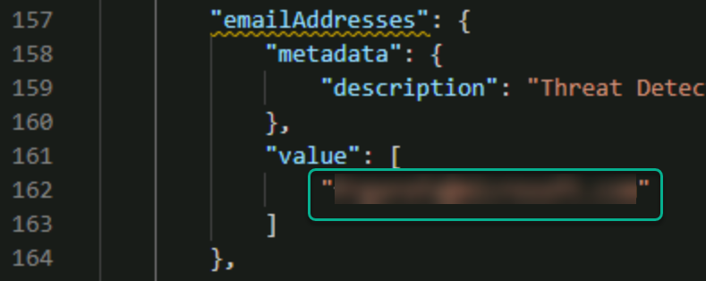

1. Save and close **sql_db.parameter.dev.json** file

#### Test deployment with PowerShell

1. Click **File** > **New File** or keyboard shortcut: *Ctrl + N*
2. Set File format to PowerShell


3. Run the following to test your ARM deployment with PowerShell

```PowerShell
Login-AzAccount
#For Azure Government use:  
#Login-AzAccount -Environment AzureUSGovernment

#Select the correct Subscription
Select-AzSubscription –Subscription '<Id>'

$params = @{
    ResourceGroupName = '<enter your RG name>' #Dev Resource Group from lab 2
    TemplateFile = '.\DLM\AzureSQLDB\Deployments\ARM\templates\sql_db.json'
    TemplateParameterFile = '.\DLM\AzureSQLDB\Deployments\ARM\parameters\sql_db.parameters.dev.json'
    Verbose = $true
}
#Test ARM deployment
Test-AzResourceGroupDeployment @params 
```
Expended Result
> VERBOSE: time ran - Template is valid.

4. Run the following to deploy your ARM template with PowerShell
   
```PowerShell
$params = @{
    ResourceGroupName = '<enter your RG name>' #Dev Resource Group from lab 2
    TemplateFile = '.\DLM\AzureSQLDB\Deployments\ARM\templates\sql_db.json'
    TemplateParameterFile = '.\DLM\AzureSQLDB\Deployments\ARM\parameters\sql_db.parameters.dev.json'
    Verbose = $true
}

#Deploy ARM template
New-AzResourceGroupDeployment @params

#To Check Resources Deployed Run:
Get-AzResource -ResourceGroupName "dlm-demo-dev" | Format-Table

```

5. You can check the status of your deployment from the protal
   1. Log into: [portal.azure.com](https:/portal.azure.com)
   2. Navagate to the Resource Group you deployed to
   3. Click on **Deployments** blade
   4. Click on **Related events** to view details about the deployment

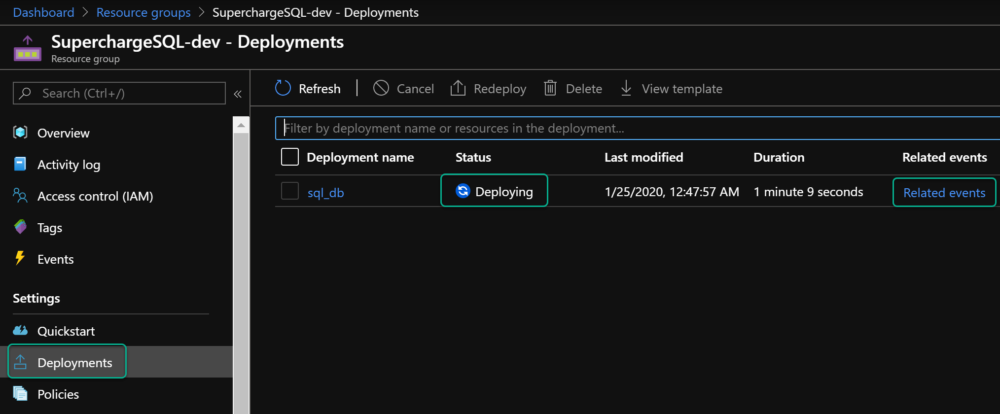

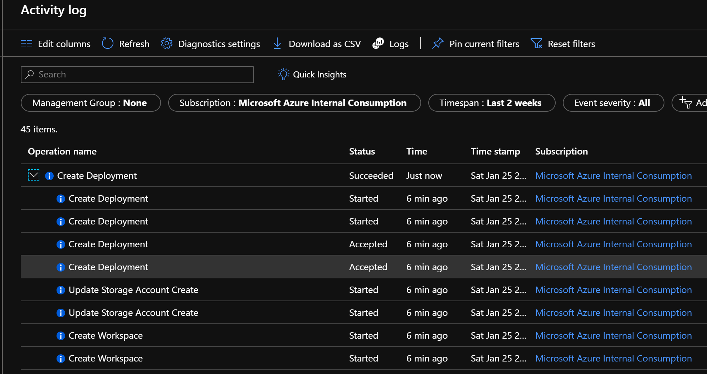

6. Once deployment completes check that all resource deployed

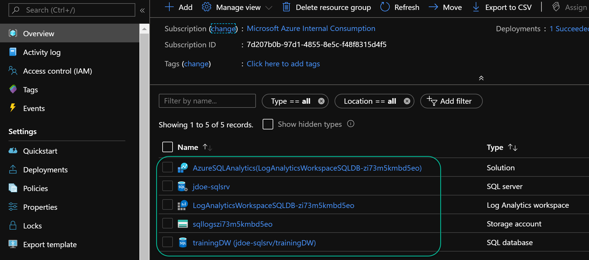

1. Close **Untitled-1** PowerShell file, no need to save
2. **Stage** & **Commit** any changes to your repo
3. **Sync** or **Push** your changes to your remote branch (Azure DevOps Repo)

## <div style="color: #107c10">Exercise - Build Pipeline (CI)</div>

In this exercise you will walk through all of the steps needed to create the Continuous integration (CI) portion of your Azure Resource deployment. This step is called the build process.  You will test that your ARM template build correctly.

1. In a browser window navigate to your DevOps project
2. Navigate to **Pipelines**
3. Click on **Pipelines**


3. Click on **Create Pipeline**
4. Click on **Use the classic editor to create a pipeline without YAML**


5. Select a source
     1. Select **Azure Repos Git**
     2. Select the **Team project**
     3. Select **Repository**
     4. Select **dev** for Default branch for manual and scheduled builds
     5. Click on **Continue**
     
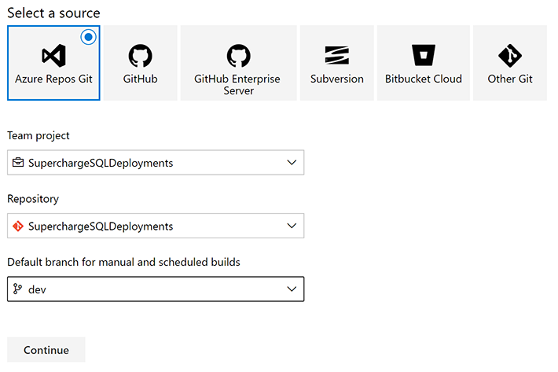

1. Select **Empty Job** at the top of the list

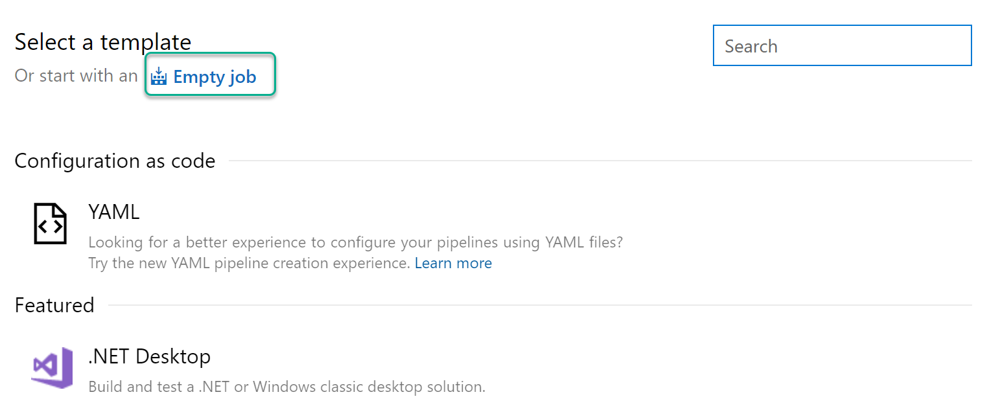

2. Update **Name** to: **Dev - Azure Resources-CI**
3. Leave defaults for **Agent Pool** & **Agent Specification**

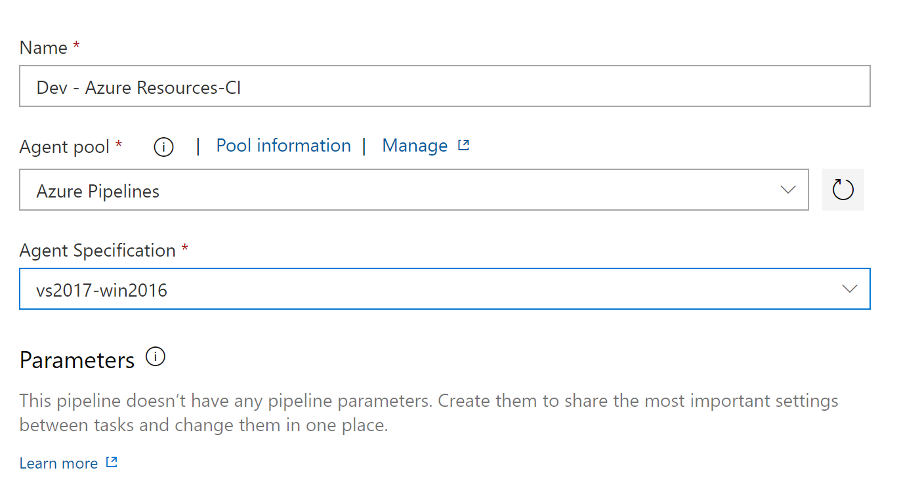

4. Click on Agent job 1
5. Update **Display Name** to: **Publish Deployment Artifacts**
6. Keep all other defaults

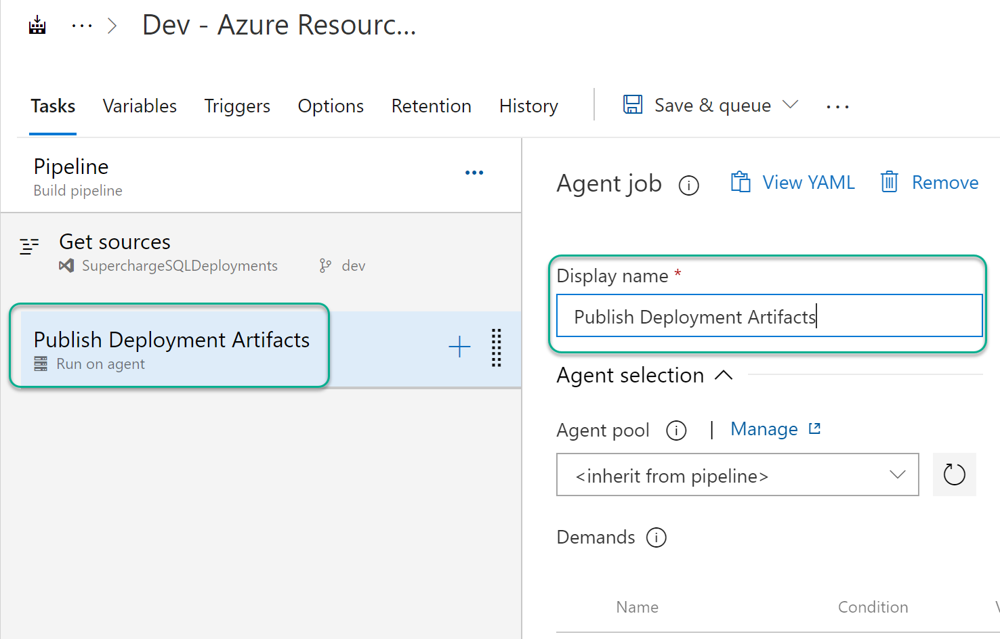

7. Click the + next to **Publish Deployment Artifacts**
8. Search for **Azure resource group** 
9. Click **Add** on the **Azure resource group deployment** task

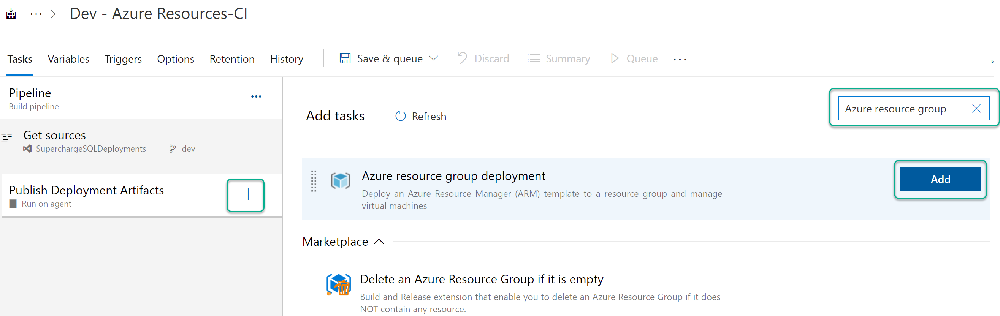

10. Click on the newly added **Azure resource group deployment** task and perform the following:
    1.  Update **Display name**: Validate Deployment ARM Templates for SQL DB
    2.  Select **Azure subscription** - You should see your Azure Service Connection that you setup earlier when configuring your DevOps environment.
    3.  **Action**: **Create or update resource group**
    4.  **Resource group**: Select your dev resource group that was setup in the pervious lab
    5.  **Location**: Select the location you used for your resource group
    6.  **Template location**: Linked artifact
    7.  **Template**: click on the ellipses and navigate to the **sql_db.json** template file to select it.
        1.  Your path should look similar to:
        
        >***Deployments/ARM/templates/sql_db.json***

    8.  **Template parameters**: click on the ellipses and navigate to the **sql_db.parameters.dev.json** template file to select it.
        1.  Your path should look similar to: 
        
        >***Deployments/ARM/parameters/sql_db.parameters.dev.json***

    9.  **Override template parameter**: leave blank for this step as we are only validating the ARM template, not deploying
    10. **Deployment mode**: Select **Validation only**
        1.  :exclamation: This is a key setting, as you only want to validate (test) your ARM template.
    11. Keep the rest of the settings as default.

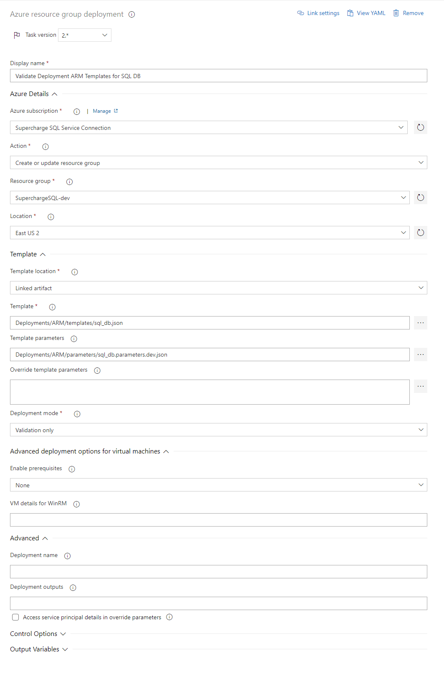

11.  Click the drop down arrow next to **Save & queue** 
12.  Select **Save**

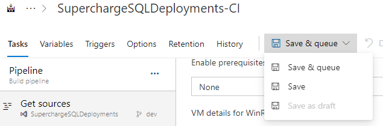

13.  Accept defaults for **Save build pipeline**

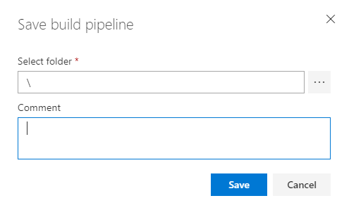

14.  Click **Save**
16.  Right click on **Validate Deployment ARM Templates for SQL DB** task, and select **Clone task**

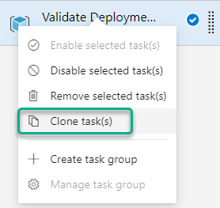

17. Update the following setting for your newly cloned task
    1.  **Display name**: set it to **Validate Deployment ARM Templates for KeyVault**
    2.  **Tempate**: click on the ellipses and navigate to the **KeyVault.json** template file to select it.
        1.  Your path should look similar to: 
        
        >***Deployments/ARM/templates/KeyVault.json***

    3.  **Template parameters**: click on the ellipses and navigate to the **KeyVault.parameters.json** template file to select it.
        1.  Your path should look similar to: 
        
        >***Deployments/ARM/parameters/KeyVault.parameters.json***

18. Click the drop down arrow next to **Save & queue** 
19. Select **Save**
20. Click **Save** on the comment window (entering a comment here is optional)
21. Click the + next to **Publish Deployment Artifacts**
22. Search for **Publish build artifacts** 
23. Click **Add** on the **Publish build artifacts** task

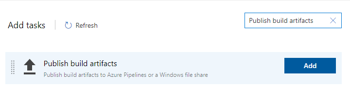

24. Edit the following setting on the **Publish Artifact** task
    1.  Set **Path to publish**: click on the ellipses and navigate to the **Deployments** directory in your repo.
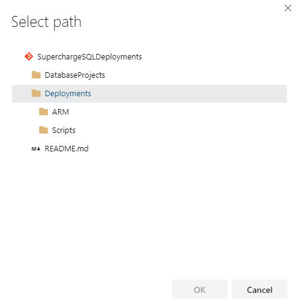

    2. **Artifact name** change drop to: **Azure Resources**
    3. Keep all other settings to default
25. Click the drop down arrow next to **Save & queue**
26. Select **Save**
27. Click **Save** on the comment window (entering a comment here is optional)

### Now you will set up the continuos integration on this build pipeline

1. Click on **Triggers** on the top menu of your build pipeline.
2. Check mark **Enable continuous integration** to automate your build
   1. This means when you check in your code the build will happen automatically
3. **Branch filters**
   1. **Type**: Include
   2. **Branch specification**: dev
4. **Path filters**
   1. Click **+Add**
   2. **Type**: Include
   3. **Path specification**: *Deployments*
   4.  Click **+Add**
   5.  **Type**: Exclude
   6.  **Path specification**: *DatabaseProjects*
   
:bulb: You are setting path filters for this pipeline, so it will only execute when code is checked in on your deployment directory.  This is where your ARM templates are located

5. Click the drop down arrow next to **Save & queue**
6. Select **Save**
7. Click **Save** on the comment window (entering a comment here is optional)

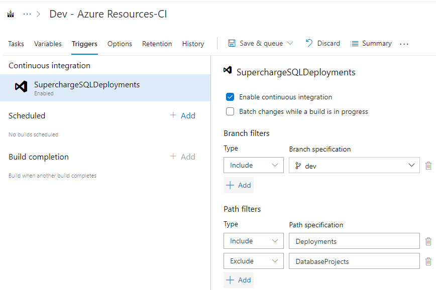

8. Click on **Options** at the top of your pipeline menu to edit some meta data for your build
9. Update the following **Build properties**
   1. **Description**: Build Pipeline for Azure Resource(s) Deployment
   2. **Build number format**:

    >\$(date:yyyyMMdd)_\$(BuildDefinitionName)_\$(SourceBranchName)\$(rev:.r)

10. Click the drop down arrow next to **Save & queue**
11. Select **Save**
12. Click **Save** on the comment window (entering a comment here is optional)

:bulb: You now have built and setup a working Continuos integrations pipeline for your Azure Resources in your dev branch.  This will be a CI pipeline used when developing and updating your ARM templates.  

### Testing Azure Resource CI pipeline

1. Click on Pipelines
2. Hover over your pipeline to expose and click on the ellipses
3. Click on **Run pipeline** (you are manually testing your build)

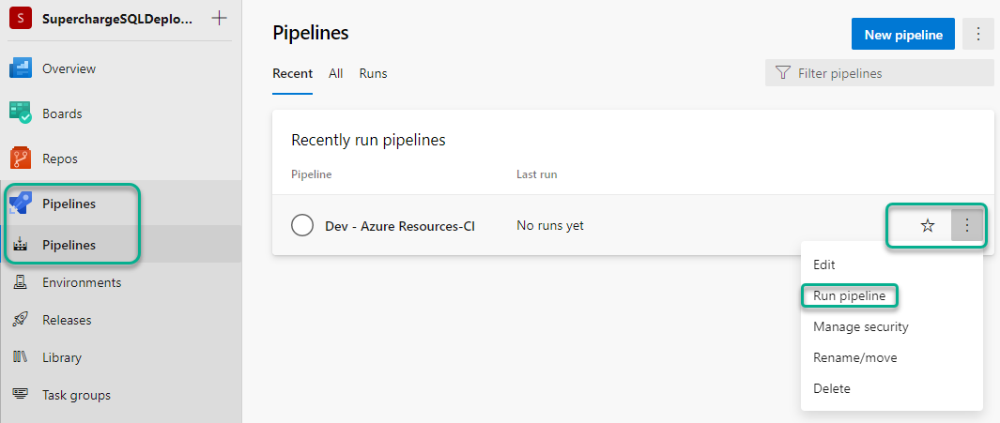

4. Keep default setting for **Run pipeline**
5. Click **Run**

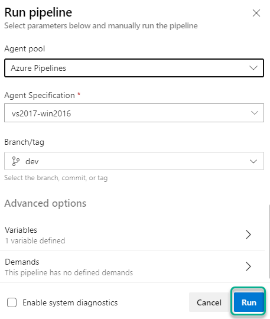

6. Click on Publish Deployment Artifacts under Jobs

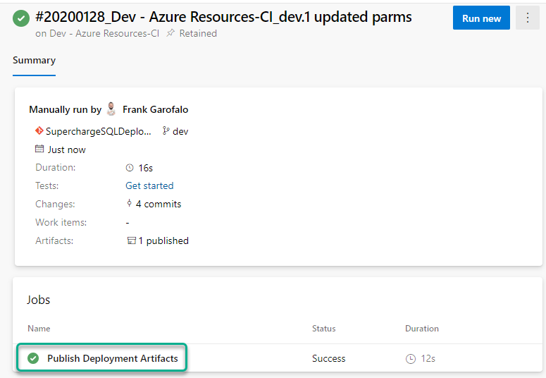

7. This is where you can view the status of your build and the logs generated durning run time. 
8. Once job finishes running you should see green check marks at each phase
9. Click on **View raw log** to view the full log of the build. Note this can be helpful when troubleshooting issues with failed builds.

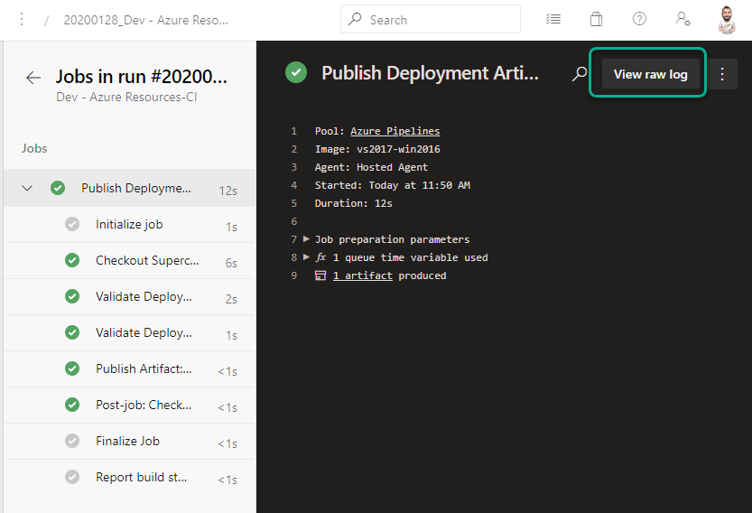

10. You now have published artifacts that can be used in your dev continuous deployment (CD) (dev Release pipeline)

## <div style="color: #107c10">Exercise - Release Pipeline (CD)</div>
In this exercise you will walk through all of the steps needed to create the Continuous Deployment (CD) portion of your Azure Resource deployment.  This step is called the **Release**.  The release will be triggered from a successful build pipeline.

1. Inside of your Azure DevOps Project click on **Pipelines** > **Release** > **New Pipeline** button.

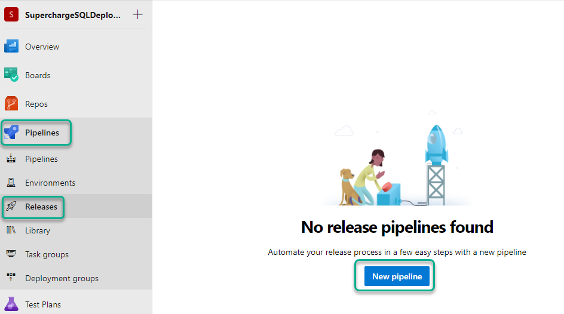

2. Select **Empty job**

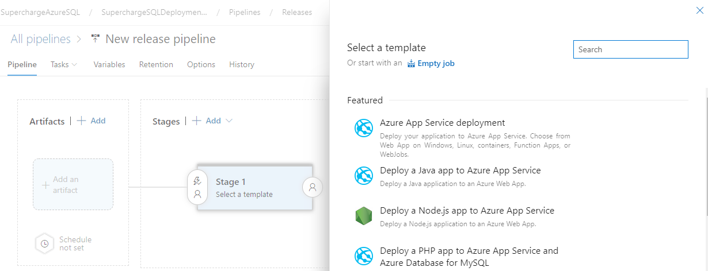

3. Set **Stage name**: ***Dev: Az Resource Deployment***
4. Click on the **X** to close Stage settings
5. Click on **New Release pipeline** to rename it to: **dev-AzureResouces-CD**
6. Click on **+ Add** on Artifacts
   1. Source type:  **Build**
   2. Project: **SuperchargeSQLDeployments** *(the name of your DevOps Project)*
   3. Source (build pipeline): **Dev - Azure Resources-CI** *(your build from last exercise)*
   4. Leave Source alias as the default value
   5. Click the **Add** button

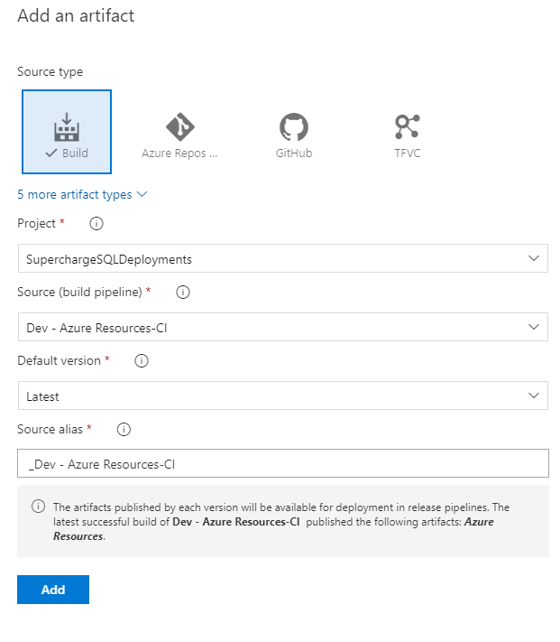

5. Click on the **Lighting bolt** icon of Artifacts
6. **Continuous deployment trigger** flip the switch to **Enabled** </br>

:bulb: Note that this setting is what is used to enable the automation for Continuous deployment.  Which is triggered from a successful build.

7. **Build branch filters** click **+ Add**
8. Set build branch to **dev**

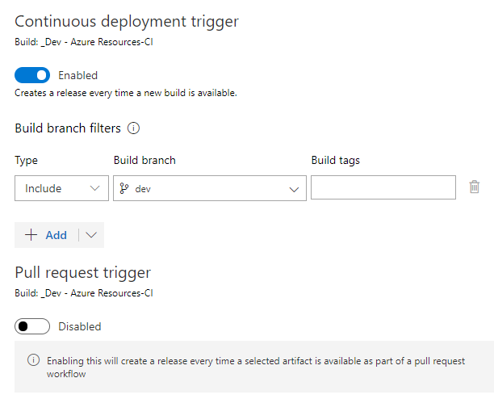

9.  Click on **1 job, 0 task** in the Stages section of your release
10. Click on the **+** button on Agent job
11. Add the **Azure resource group deploymnet** task
12. Once added click on the task to configure with these settings:
    1.  Display name: **Clear Resource Group**
    2. Select **Azure subscription** - You should see your Azure Service Connection that you setup earlier when configuring your DevOps environment.
    3.  **Action**: **Create or update resource group**
    4.  **Resource group**: Select your dev resource group that was setup in the pervious lab
    5.  **Location**: Select the location you used for your resource group
    6.  **Template location**: Linked artifact
    7.  **Template**: click on the ellipses and navigate to the **empty-template.json** template file to select it.
        1.  Your path should look similar to:
        
        > ***$(System.DefaultWorkingDirectory)/_Dev - Azure Resources-CI/Azure Resources/ARM/templates/empty-template.json***

    8.  **Template parameters**: leave blank
    9.  **Override template parameter**: leave blank
    10. Deployment mode: **Complete** you will deploy this empty template in Complete mode to clear out your resource group.
    11. Expand **Control Option**
    12. Set **Run this task** to: **Custom conditions**
    13. Set **Custom condition** to: eq(variables['clearResources'], 'yes')
        * Using a variable to set when/if to clear Resource Group
    14. Click **Save** (Comment is optional) > **OK**

### Configure Key Vault deployment task

1. Add a New Azure resource group deployment task configured with the following:
  
    1. Display name: **Azure Deployment: Key Vault**
    2. Update:  **Azure subscription, Action, Resource group, Location, Template location** to match the same as the pervious Azure RG Deployment task
    3. Template: 
    
    >**$(System.DefaultWorkingDirectory)/_Dev - Azure Resources-CI/Azure Resources/ARM/templates/KeyVault.json** 

    4. Template parameters: 
    
    >**$(System.DefaultWorkingDirectory)/_Dev - Azure Resources-CI/Azure Resources/ARM/parameters/KeyVault.parameters.json** 
    
    5. Override template parameters:
   
```PowerShell
-keyVaultName "$(keyvault.VaultName)-$(rEnv)" 
-accessPolicies [
    {
        "objectId": "$(sp.ObjectId)",
        "tenantId": "$(sp.tenantId)",
        "metadata": {
            "description": "Service Principal - DevOps-DLM"
        },
        "permissions": {
            "keys": [
                "Get",
                "List",
                "Update",
                "Create",
                "Import",
                "Delete",
                "Recover",
                "Backup",
                "Restore"
            ],
            "secrets": [
                "Get",
                "List",
                "Set",
                "Delete",
                "Recover",
                "Backup",
                "Restore"
            ],
            "certificates": [
                "Get",
                "List",
                "Update",
                "Create",
                "Import",
                "Delete",
                "Recover",
                "ManageContacts",
                "ManageIssuers",
                "GetIssuers",
                "ListIssuers",
                "SetIssuers",
                "DeleteIssuers"
            ],
            "storage": [
                "Get",
                "List",
                "Update",
                "Set",
                "Delete",
                "Regeneratekey",
                "Recover",
                "Backup",
                "Restore"
            ]
        }
    }
] 
-tenant "$(sp.tenantId)" 
-location "$(location)" 
-enabledForDeployment false 
-enabledForTemplateDeployment true 
-enabledForDiskEncryption false

```
:exclamation: This overrides the values in your parameters file. It's best practice not to save protected credentials / settings in your Git repo. You will setup the variables and values once you have completed configuring your release tasks. </br>

   6. Deployment mode: **Incremental**
   7. Click **Save** (comment optional) > **OK**

### Configure SQL DB deployment task

1. Add a New Azure resource group deployment task configured with the following:
   1. Display name: **Azure Deployment: SQL Database**
   2. Update: **Azure subscription, Action, Resource group, Location, Template location** to match the same as the pervious Azure RG Deployment tasks
   3. Template:
   
    >**$(System.DefaultWorkingDirectory)/_Dev - Azure Resources-CI/Azure Resources/ARM/templates/sql_db.json** 

  
   4. Template parameters: 
   
    >**$(System.DefaultWorkingDirectory)/_Dev - Azure Resources-CI/Azure Resources/ARM/parameters/sql_db.parameters.dev.json**
            
   5. Override template parameters:

   > -serverName "\$(sql.serverName)-$(rEnv)"

   6. Deployment mode: **Incremental**
   7. Deployment outputs: **sql.Output**
   8. Click **Save** (Comment is optional) > **OK**

### Configure PowerShell task

1.  Click **+** on Agent job
2.  Search for **PowerShell**
3.  Click **Add** on the PowerShell tasks

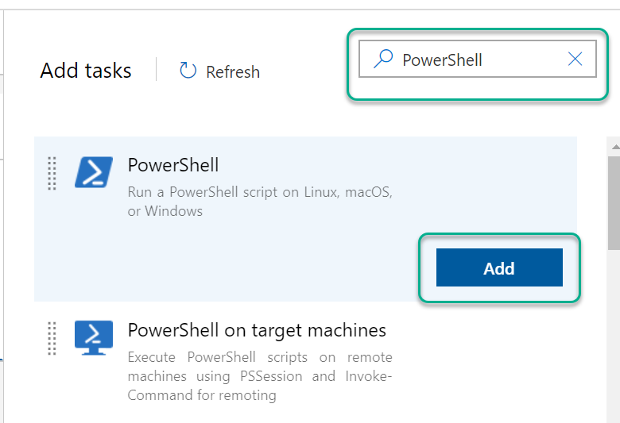

4. Click on the newly added PowerShell task and set the following:
   1. Task version: **2.\***
   2. Display name: **Parse SQL Database Outputs**
   3. Type: **File Path**
   4. Script Path:

   > $(System.DefaultWorkingDirectory)/_Dev - Azure Resources-CI/Azure Resources/Scripts/Parse-ARMOutputs.ps1

:bulb: This script is used to parse the output values of admin username and password from your SQL DB deployment.  It writes the output values to variables which will later be written back to Key Vault. This is often a technique used to move values around in a pipeline. The script is:

```PowerShell
param (
    [Parameter(Mandatory=$true)][string]$ARMOutput
    )

#region Convert from json
$json = $ARMOutput | convertfrom-json
$sqlAdminLogin = $json.administratorLogin.value
$sqlAdminPass = $json.administratorLoginPassword.value
#endregion

#region Parse ARM Template Output
Write-Host "##vso[task.setvariable variable=sql.Login]$sqlAdminLogin"
Write-Host "##vso[task.setvariable variable=sql.Pass;issecret=true]$sqlAdminPass"
#endregion

```
   4. Arguments:

> -ARMOutput '$(sql.Output)'

   5. Click **Save** (Comment is optional) > **OK**

### Configure Azure PowerShell task

1.  Click **+** on Agent job
2.  Search for **Azure PowerShell**
3.  Click **Add** on the Azure PowerShell tasks

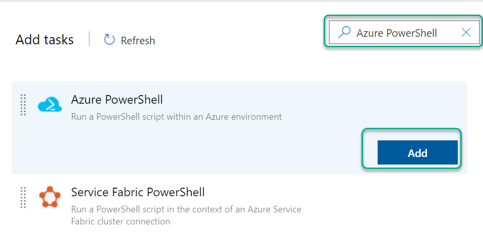


4. Click on the newly added Azure PowerShell task and set the following:
   1. Task version: **4.\***
   2. Display name: **Key Vault write Resource Keys**
   3. Azure Connection Type: **Azure Resource Manager**
   4. Azure Subscription: **Set this to your Service Connection** (perviously setup in Configuring your DevOps Environment lab)
   5. Script Type: **Script File Path**
   6. Script Path:

   > $(System.DefaultWorkingDirectory)/_Dev - Azure Resources-CI/Azure Resources/Scripts/KeyVault-WriteSecrets.ps1

   :bulb: This script is used to write the SQL admin account info to your Key Vault. Take a minute to review the script so you understand what is is doing:

```PowerShell

Param(
	$kVaultName,
	$ResourceGroup,	
	$adminLogin,
    $adminPass
    )

Function ToSecret {
	Param($val)
	$secret = ConvertTo-SecureString -String $val -AsPlainText -Force
	$secret 
	}

$kvSecrets = @{
	'SQLadminLogin' = ToSecret -val $adminLogin
	'SQLadminPass' = ToSecret -val $adminPass
}

ForEach($Key in $kvSecrets.Keys){
	$response = Set-AzKeyVaultSecret -VaultName $kVaultName -Name $Key -SecretValue $kvSecrets[$Key]
	Write-Host $response
    }
    
```
   7. Script Arguments:

> -kVaultName "\$(keyvault.VaultName)-\$(rEnv)"</br>
> -ResourceGroup \$(ResourceGroup)$(rEnv)</br>
> -adminLogin $(sql.Login)</br>
> -adminPass $(sql.Pass)</br>

   8. Azure PowerShell Version: **Latest installed version**
   9. Click **Save** (Comment is optional) > **OK** </br>

:exclamation: At this point your Release pipeline's **Tasks** should look like this:

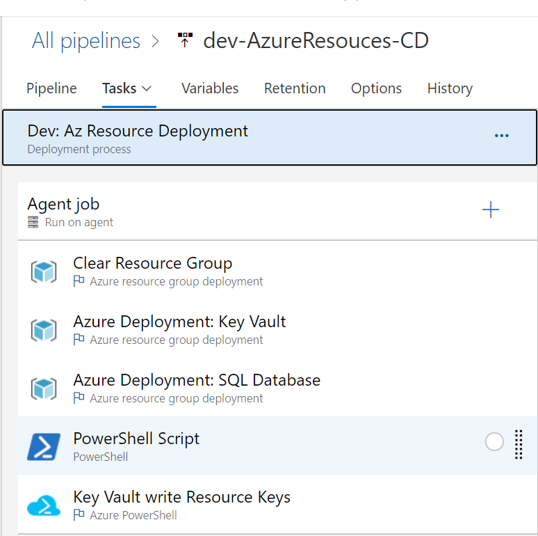

### Configure Variables

You need to configure and set the values of your variables that will be used in this release pipeline.  Variables are used to make your pipelines more flexible and dynamic.

1. Click on the **Variables** section of your pipeline
2. Create the following **Pipeline variables**

    |Name           |Value  |
    |:---           |:---   |
    |clearResources | no   |
    |rEnv           | dev   |

3. Click **Save** (Comment is optional) > **OK**
4. Click on **Variable groups** (these are variables that can be shared throughout any pipeline in your project)
5. Click on **Manage variable groups** (this will open a new browser tab)
6. Click **+ Variable group**

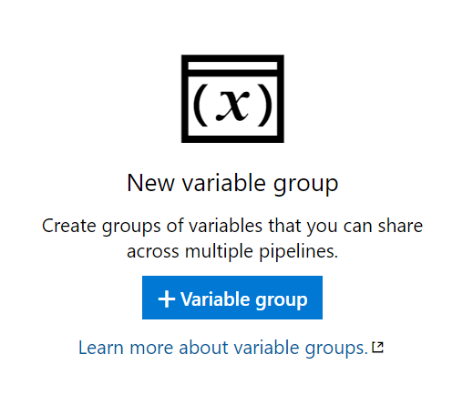

7. Variable group name: **SuperchargeSQL-Vars**
8. Description: **Variables used for Supercharge SQL deployments**
9. Allow access to all pipelines: **turn on switch**
10. Click **+ Add** > Add the following Variables:

    |Name                   |Value                |  |
    | :---                  |:---                 | :---   |
    | keyvault.VaultName    | {your alias}-vault |  |
    | ResourceGroup         | SuperchargeSQL-       |  |
    | sp.DisplayName        | {your Service Princple Name} |  |
    | sp.ObjectId           | {same location as RG} |    |
    | sp.tenantId           | {your tenantID} |    |
    | sql.databaseName      | ["trainingDW"] |    |
    | sql.Login             | leave blank |    |
    | sql.Pass              | leave blank |    |
    | sql.serverName        | {your alias}-sqlsrv |  |
    | sql.Output            | leave blank |  |
    | location           | eastus2  |  |

:exclamation: **To get the correct sp.ObjectID use the below PowerShell**

```PowerShell
Login-AzAccount
#For Azure Government use:  
#Login-AzAccount -Environment AzureUSGovernment

$sp = Get-AzADServicePrincipal -DisplayName 'SuperchargeSQL-SP'
$sp.Id
```


11. Click **Save**
12. Your **Variable group** should look similar to this:

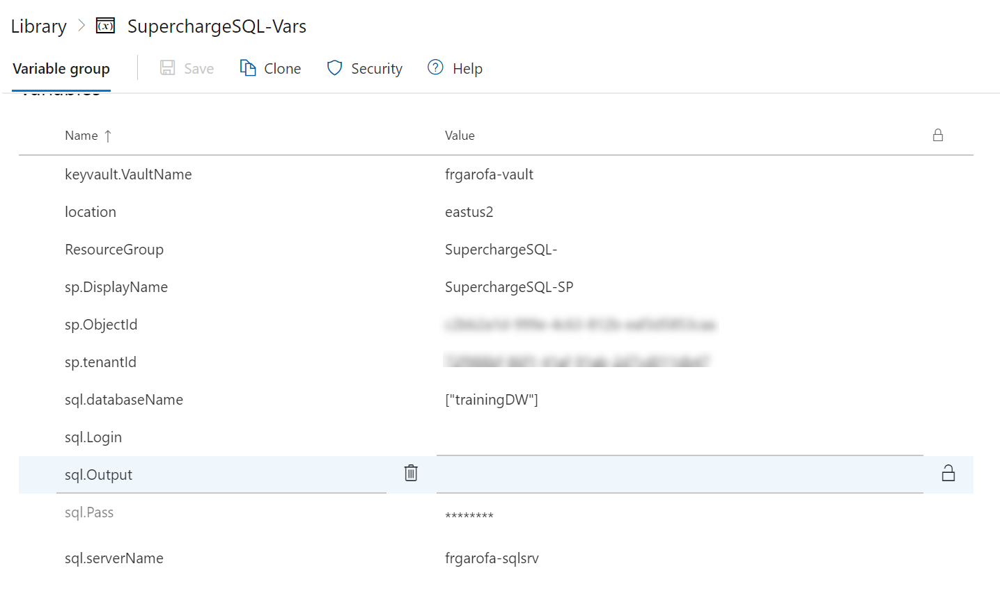

13. Close the Library tab and navigate back to the open browser tab with your **Release**
14. Click on **Variables** > **Variable groups** > **Link variable group**
15. Select your Variable group created in the pervious steps: **SuperchargeSQL-Vars**
16. Click the **Link** button
17. Click **Save** (Comment is optional) > **OK**
18. Click **Create release** to manually trigger 
19. Select Stages for a trigger... : **Dev: Az Resource Deployment**
20. Click **Create** button
21. CLick on Release **Release-\<num>** has been created

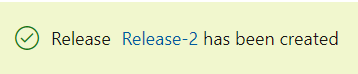

22. If you get a popup window about the new improvement to the release summary page feel free to close or review for more information
23. Notice that in **Stages** it says **Not deployed** this is because it was manually triggered 
24. Hover over **Dev: Az Resource Dep** to expose the **Deploy** button > Click it

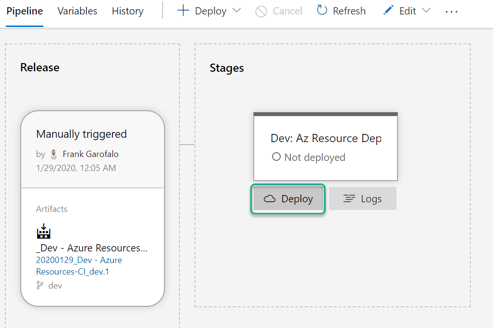

25. Comment is optional > Click **Deploy**
26. Click on **In progress** to view status of deployment
    1.  You can also navigate to your resource group in Azure and view status of the deployment on the Deployments blade

:exclamation:  If you want to clear your Resource Group durning this **dev** stage set the **clearResources** variable to **yes**. Since this would meet the custom condition you will be  deploying an "empty" template in Complete mode. Which will clear out your resource group (delete all resource not in your template).  This can take a bit of time and even timeout to complete.  While you are waiting for your Release to complete, review the logs as it deploys, or feel free to move on with the next steps in this lab. Don't forget to check status and address any errors.

**Expected Results**