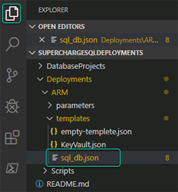
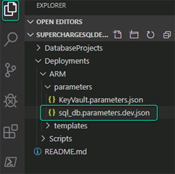
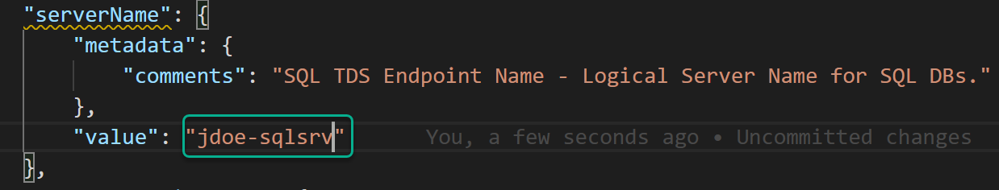
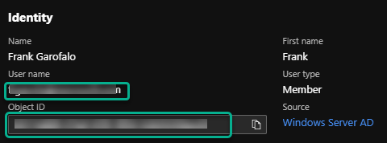
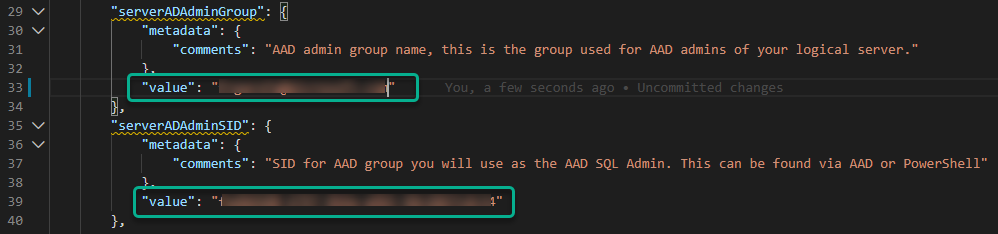
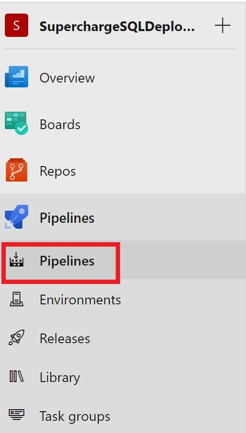
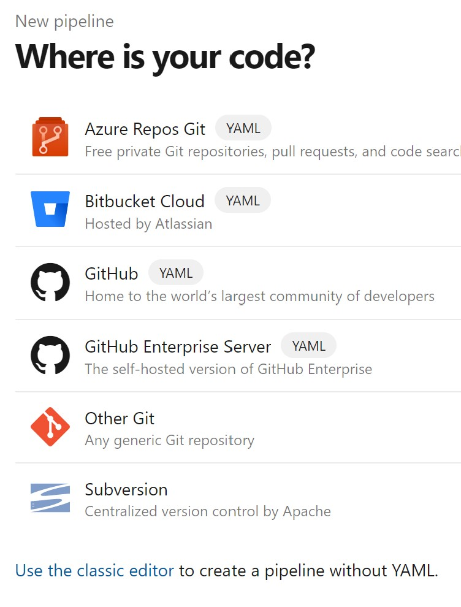
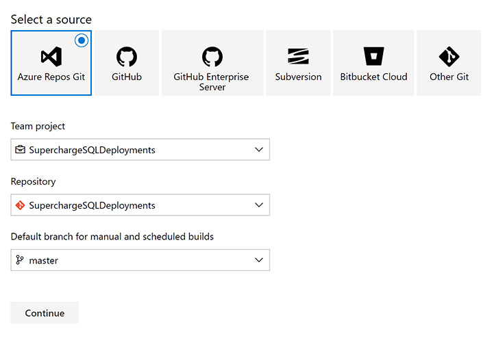

## Lab 3 - Deploy Azure Resouces
--------------------------------

[Back to all modules](/docs/labs/README.md)

| Lab Description:            | This lab covers all the steps needed to deploy Azure Resource with Azure DevOps pipelines.   |
| :------------              | :--------------       |
| Estimated Time to Complete: | 30 minutes            |
| Key Takeaways:              | 1. Understand Adanvced ARM templates |
|                            | 2. Create CI/CD pipelines            |
|                            | By the end of this lab, you should have an understanding of: advanced ARM templates, how create build and release pipelines, how to deploy Azure Resources with DevOps         |
| Author(s):                     | Frank Garofalo             |

### Purpose
This lab is to build your foundational knowledge of how to leverage Azure DevOps to deploy Azure Resource with CI/CD pipelines.  This lab walks you through advanced ARM templates showing you how you can have an end state configuration for your Azure resource to limit the need to do post deployment configuration. You will create both a build and release pipeline which covers the CI/CD portions of DevOps.

 **Summary**
  * [Review Adanced ARM templates]({summerylinke})
  * [{summary link}]({summerylinke})
  * [{summary link}]({summerylinke})

## 
Exercise - Advanced ARM template

### Lunch VS Code

1. Open **sql_db.json**
   1. Located in: **Deployments** > **ARM** > **templates** 
   

2. Review lines **180 - 196** there are multiple example of how you can use functions in ARM templates to control behavior and maybe your deployments dynamic.
3. Review lines **376** - **410**, these resources are examples of how you can create multiple Firewall Range rules and/or vNet Firewall rules using copy index and a parameter array
4. Review lines **411** & **486** this is an example of how to use copy index to deploy mulitiple databases with the option of diffent skus for each DB  

   1. Also note that this resource uses a nested resource to perform some other configurestions on each database like: ensure TDE is enabled, auditing is configured, and Security Alert Policies are set
   
5.  This ARM templete can be used to be deploy: Storage account, Log Anylitics, SQL Logtical Server, and multiple SQL DB(s).  

>You may see older schema versions this is becuase the templete is designed to work in both Azure Commerical and Azure Government

6.  Close **sql_db.json** without saving anything

#### Edit parameter file

1.  Open **sql_db.parameter.dev.json**
    1.  Located in: **Deploymnets** > **ARM** > **parameter**  
    

2. Befor makeing any changes to the parameter file spend some time reviewing it and reading through all of the comments.
   1. Each parameter has comments to help provide you with context of the value needed
   2. For this workshop you will only need to updated the values we call out, but are free to test other values outside of the workshop.

3. Enter name for **serverName**, line **27**
   1.  The server name needs to be gloabally unique
   2.  Recommend using: **\<alias>-sqlsrv** (ie jdoe-sqlsrv)  
      

4. Enter **serverADAdminGroup** at line **29** and **serverADAdminSID** at line **39**
   1. You can look up these values in Azure AD  
     
     
5. 

5. Navigate to **Pipelines**
6.  Click on **Pipelines**

3. Click on **Create Pipeline**
4. Click on **Use the classic editor to create a pipeline without YAML**

5. Select a source
     1. Select **Azure Repos Git**
     2. Select the **Team project**
     3. Select **Repository**
     4. Select **master** for Default branch for manual and scheduled builds
     5. Click on **Continue**
     

6. Select **Empty Job** at the top of the list
7. Select **Save** from the drop down menu
8. Select the default folder and click **Save**
