## Lab 4 - Database life cycle management (DLM)
--------------------------------

[Back to all modules](/docs/labs/README.md)

[comment]: <> (Lab header table provide values for lab)

| Lab Description:            | This lab covers database life cycle management.   |
| :------------               | :--------------             |
| Estimated Time to Complete: | 60                          |
| Key Takeaways:              |By the end of this lab, you should understand how to implement database life cycle management. Having a good grasp on the key princples of DLM:|
|                              |SSDT Database projects |
|                              |Create & configure build & release pipelines (CI/CD) for database change management |
|                              |Unit testing |
|                              |Leverage the power of sqlpackage.exe|
| Author(s):                    | Frank Garofalo             |

[comment]: <> (Write up purpose for this lab, provide some info on the what and why) 
### Purpose

This module is designed to build upon the skills you have learned thus far, and apply them to Database Life cycle Management (DLM). It walks through all of the core concept of DLM, providing you will a full working DLM PoC. 

 **Summary**
- [Initial SSDT project setup](/docs/labs/4-DatabaseLifecycleManagement.md#initial-ssdt-project-setup)
- [Get to know SSDT database projects](/docs/labs/4-DatabaseLifecycleManagement.md#get-to-know-ssdt-database-projects)
- [Build your database project](/docs/labs/4-DatabaseLifecycleManagement.md#build-your-database-project)
- [Load data to your local DB](/docs/labs/4-DatabaseLifecycleManagement.md#load-data-your-local-db)
- [Dev Database build pipeline (CI)](/docs/labs/4-DatabaseLifecycleManagement.md#exercise---dev-database-build-pipeline-ci)
- Dev Database Release Pipeline (CD)
- Unit Testing
- Prod Pipeline
- sqlpackage.exe


[comment]: <> (Main Exercise format) 
## <div style="color: #107c10">Exercise - Review SSDT database project</div>

In this exercise you are going to review a database project for a simple demo style database.

### Initial SSDT project setup
 
1. Launch Visual Studio 2019
   1. If this is the first time launching Visual Studio it may ask you to sign in. If you have an MSDN account we recommend signing in. If not, feel free to select *Not now, maybe later.* 
   2. You maybe asked select the development Settings, and a color theme.  We recommend General, and the theme of your choice. 
2. Click on **Open a project or solution**
3. Navigate to: **C:\SuperchargeSQLDeployments\DatabaseProjects\trainingDW**
4. Select the solution file: **trainingDW.sln**
5. Click on **master** in the bottom right corner > **Manage Branches**
   
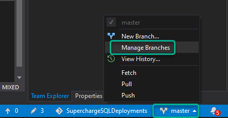

6. Ensure you are working with the **dev** local branch. 
    1. Expand **remotes/origin** > select **dev** (you may need to dbl click to select it)
The **dev** branch should now be in your local Git dir

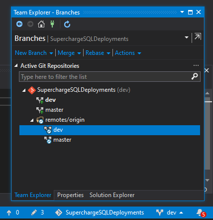

:bulb: Just like in VS Code you will want to develop & edit in the **dev** branch.  **Master** is configured only to be updated from pull requests.

### Get to know SSDT database projects
1. In the **Solution Explorer** right click on **trainingDW** > **Properties**
   1. From here you can set and configure settings for your project
   2. Notice your **Target platform:** is set to **Microsoft Azure SQL Database**
   3. Click on the arrow to view other Target platforms available (leave it as Azure SQL DB)
2. Click on the **Database Settings...** button

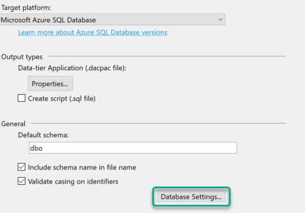
   
3. Click through the **Common**, **Operational**, and **Miscellaneous** tabs
   1. Notice that **Database collation** is the only setting you can change. This is because your target platform is set to **Microsoft Azure SQL Database**
   2. Spend a couple minutes changing the Target Platform and then reviewing the **Database Settings...** that are available to configure
   3. Make sure to set **Target platform:** back to **Microsoft Azure SQL Database**
4. Close the **trainingDW Project Setting**
5. In the **Solution Explorer** expand **trainingDW**
6. Expand folder **dim**
   1. Notice the folder structure: Tables, Views
   2. Database projects are designed to work in a folder structure to organize your schema, similar to what you see via SSMS
   3. Expand **dim** > **Tables**
   4. Notice how each file is named: **schema.tableName.sql** (each database object is stored as a SQL script)
   5. Click on **dim.Attendee.sql** to open it.
   6. Spend a minute to review (you can edit in the designer or T-SQL)

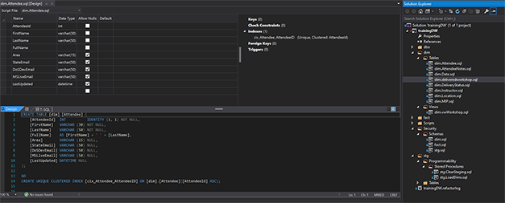

7. Close **dim.Attendee.sql**
8. Right click on **dim.Attendee.sql** > Hover over Refactor

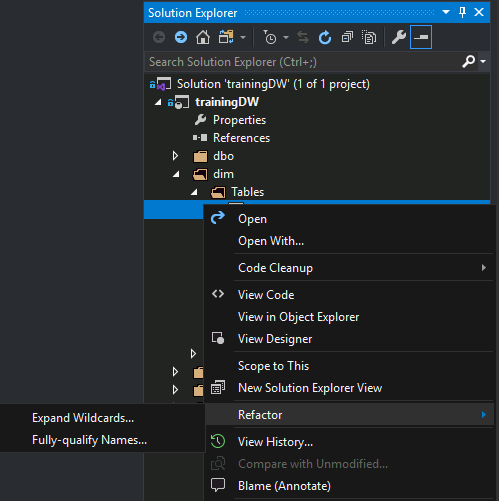

9. Note the options you can use to refractor your scripts
10. Click on **Fully-qualify Names..**
11. Review how this option can quickly refactor your script to use *Fully Qualified Names*
12. Click **Cancel**

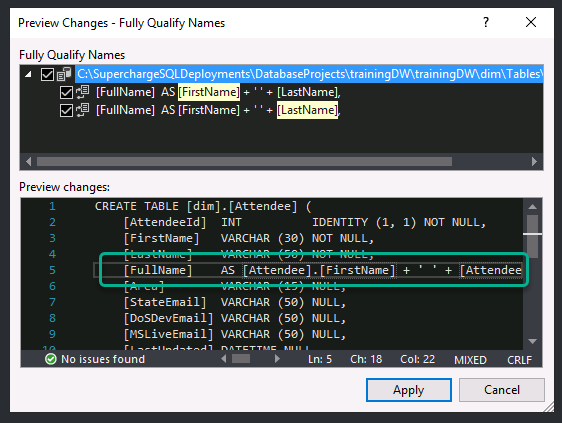

13. From the main Visual Studio menu bar click **View** > **SQL Server Object Explorer**

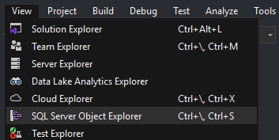

14. Expand **Projects - trainingDW** > **Tables** > Right click on: **dim.Attendee**
15. Hover over **Refactor**
16. Notice you have additional refactoring options
    1.  Feel free to click through each to see how they work (**do not apply the changes**)

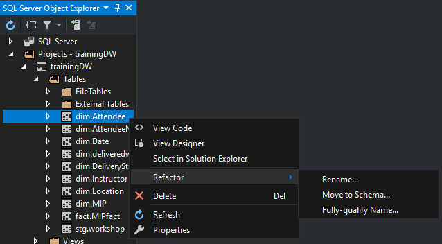

17. Close any open windows
18. Open file: **trainingDW.refactorlog** from **Solution Explorer**
    1.  Note that all refactored changes are logged and can be reviewed. This is a nice option to have if you need to check what changed in your database quickly from the last deployment.
    2.  Close **trainingDW.refactorlog**

### Build your database project

1. From the **Solution Explorer** right click on **trainingDW** > Click on **Build**

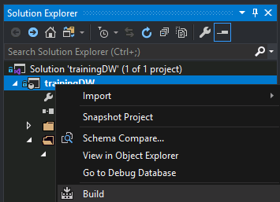

2. Expected Result

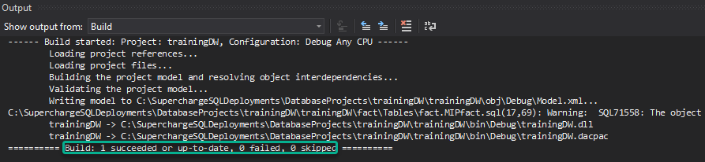

:exclamation: In order to deploy database projects it has to be able to build.  When the project builds it generates a **dacpac** which is used by sqlpackage.exe to deploy schema.  

3. In the **SQL Server Object Explorer** expand **SQL Server** > (localdb)\ProjectsV13... > **Databases**
4. After a successfully **build** you will have a local version of your database which you can use for local testing.

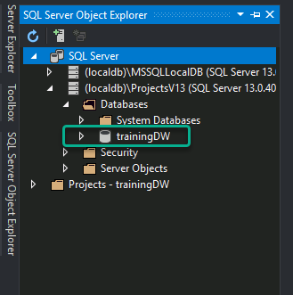

5. Expand **trainingDW** > **Tables**
   1. Notice there are no tables or any schema in this local version.
   2. The build process only creates a blank database
6. From the **Solution Explorer** > Right click on **trainingDW** > **Schema Compare...**
7. Your source should be pre-populated with the DB project
8. Click on the drop down arrow next to ***Select Target*** > **Select Target**


9. Select Target Schema > Database: > Select Connection

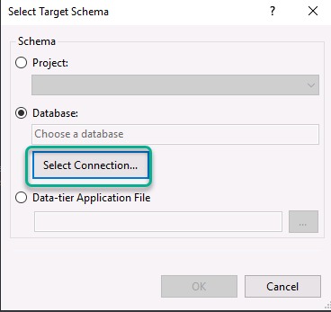

10. Click on the **Browse** Tab
11. Expand **Local** > **ProjectsV13**
12. Set Database Name: **trainingDW**
13. Click **Connect**

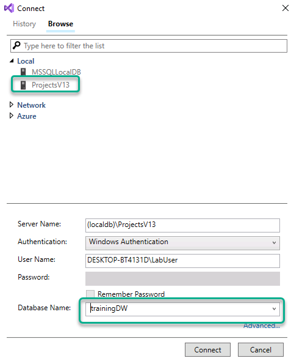

13. Click **OK** on **Select Target Schema** window
14. Click on the **Gear** icon from the Compare menu

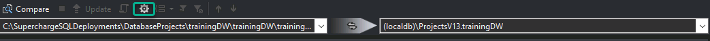

15. Clink on the **General** and **Object Types** tabs and review the options you can enable/disable for your schema compare.
16. Leave all values default > Click **Cancel**
17. Click **Compare** 
18. Review results
19. Click the **Update** button > **Yes**
20. From **SQL Server Object Explorer** review the **trainingDW**
    1.  Notice that now all of your schema changes from your DB project is updated in your local version of **trainingDW**
    2.  This is a light weight way to test your development before committing changes to Git and pushing to Azure DevOps
21. Close **SQLSchemaCompare** > **Don't Save**

### Load data your local DB

1. From **Solution Explore** 
2. Expand the **Scripts** folder > dbl Click on **LoadDateDim.sql**
3. Notice you are connected to the local copy of **trainingDW**

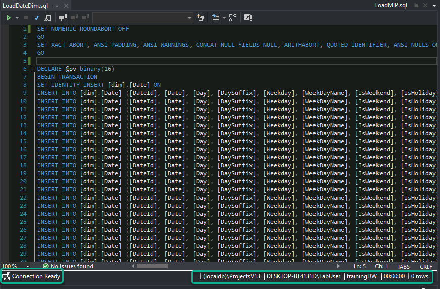

4. Execute script
  
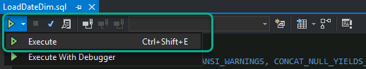

5. Close **LoadDateDim.sql**
6. From **SQL Server Object Explorer** > right click on **trainingDW** > **New Query**

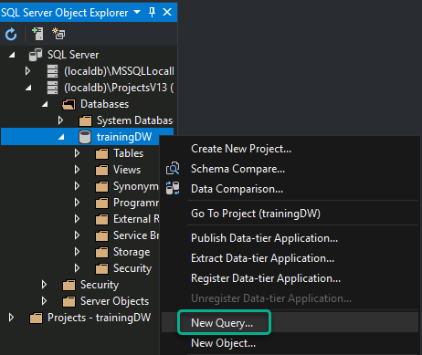

7. Execute the below T-SQL to test that your script loaded the dim.date
  
  ```T-SQL

  Select count(*) as dimDateCount From dim.Date

  Select top 10 * From dim.Date

  ```

:bulb: This is an easy way to test scripts locally before you deploy changes to your Azure dev environment.

1. Close **SQLQuery1.sql** > **Don't Save**

## <div style="color: #107c10">Exercise - Dev Database Build Pipeline (CI)</div>

1. Using a browser navigate to your Azure DevOps project
2. Navigate to **Pipelines** > **Pipelines**
3. Click the **New pipeline** button
4. Click on **Use the classic editor**
5. Select a source: **Azure Repos Git**
6. Set **Default branch for manual and scheduled builds** to **dev**
7. Click **Continue**
8. Click **Empty job**
9. Name: **Dev - Azure SQL Deployments-CI**

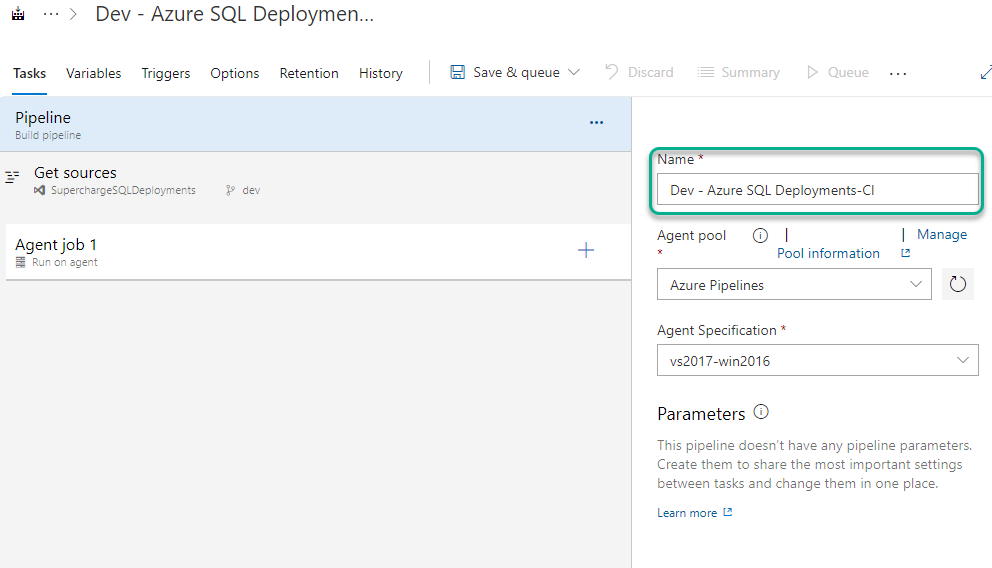

10. Click on the Agent job 1 and update the following setting:
    1. Display name: **Build trainingDW database**
11. Click on the **+** icon to add a new task
    1.  Search for: **Visual Studio build**
    2.  Click the **Add** button on the Visual Studio build

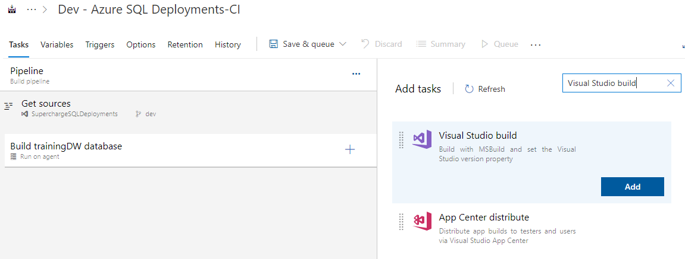

12. Click on the newly added **Visual Studio build** task and update the following settings:
    1. Display name: **Build solution trainingDW/trainingDW.sln**
    2. Solution: **DatabaseProjects/trainingDW/trainingDW.sln**
    3. Platform: **$(BuildPlatform)**
    4. Configuration: **$(BuildConfiguration)**
    5. Check mark **Clean**

13. Click on the **+** icon to add a new task
    1.  Search for: **Publish build artifacts**
    2.  Click **Add**

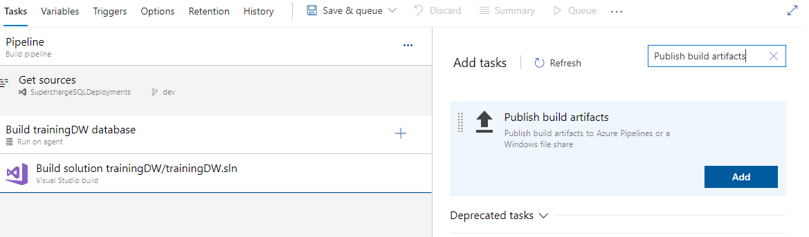

14. Click on the newly added **Publish build artifacts** task and update the following settings:
    1.  Display name: **Publish Artifact: trainingDW-drop**
    2.  Path to publish: **DatabaseProjects**
    3.  Artifact name: **trainingDW**
15. Click on **Variables** > add the following:
    1.  **BuildConfiguration**: **release**
    2.  **BuildPlatform**: **any cpu**

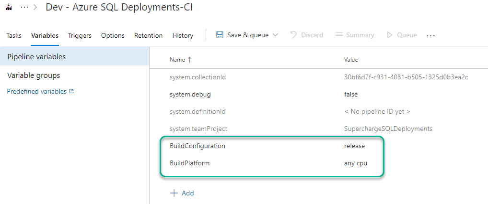

16. Click **Triggers** to configure continuos integration
    1.  Enable continuous integration
    2.  Branch filter: **dev**
    3.  Add Path filter: **Include**: **DatabaseProjects**
    4.  Add Path filter: **Exclude**: **Deployments**

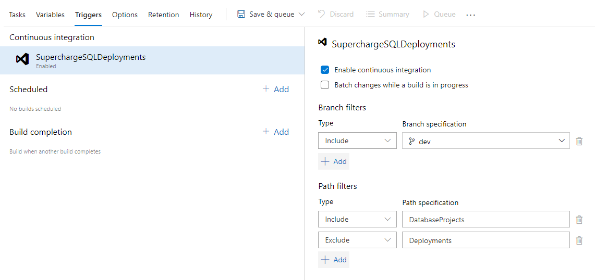

:bulb: The include and exclude filters set to make sure that continuous integration only kicks off when there has been changes committed for the database project.

17. Click **Options**
18. Update Build number format to:
```
$(date:yyyyMMdd)_$(BuildDefinitionName)_$(SourceBranchName)$(rev:.r)
```

19. Click **Save & queue** > **Save** (Comment optional) > **Save**
20. Click **Queue** > **Run**
21. Click into **Build trainingDW database** in the jobs section to view the status of your build

**Expected result**

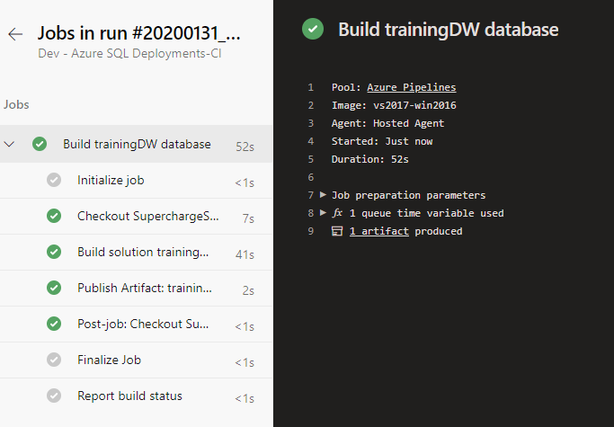

**You now have a working CI Pipeline to build your SSDT Database project**

## <div style="color: #107c10">Exercise - Dev Database Release Pipeline (CD)</div>

### Setup Key Vault Library

1. In your Azure DevOps project click on **Pipelines** > **Library**
2. Click **+ Variable group**

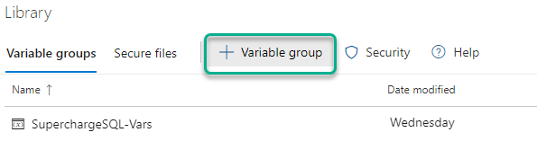

3. Variable group name: **SuperchargeSQL-KeyVault-dev**
4. Description: **Dev Key Vault linked secrets**
5. Enable **Link secrets from an Azure key vault as variables**
   1. Select Azure subscription: **Use your Service Connection** (created when you setup Azure DevOps)
   2. Key vault name: **Select your dev vault**
   3. Click **+ Add** under the Variables section

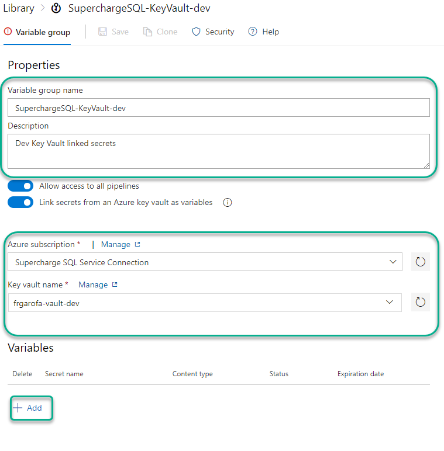

   4. Select both secrets: **SQLadminLogin** & **SQLadminPass**
   5. Click **Ok** button

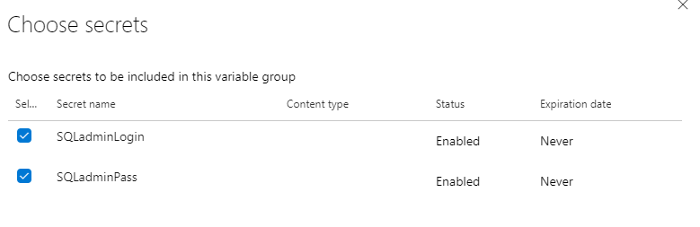

6.  Click **Save**

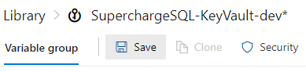

### Dev Release pipeline

1. In your Azure DevOps project click on **Pipelines** > **Releases**
2. Click on the **Create release**

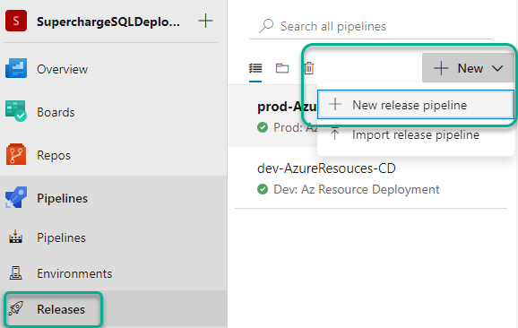

3. Click **Empty job**

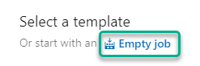

4. Update **Stage name**: **Dev: trainingDW DB**
5. Click on the **X** to close Stage

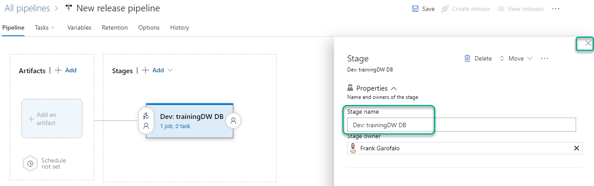

6. Click on **New release pipeline** to rename to: **dev-AzSQLDatabase-CD**

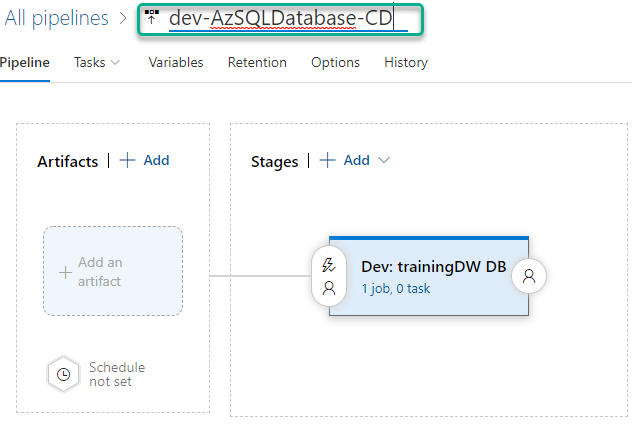

7. Click **+ Add** next to Artifacts 
8. Source type: **Build**
9. Source (build pipeline): **Dev - Azure SQL Deployments-CI**
10. Click **Add**

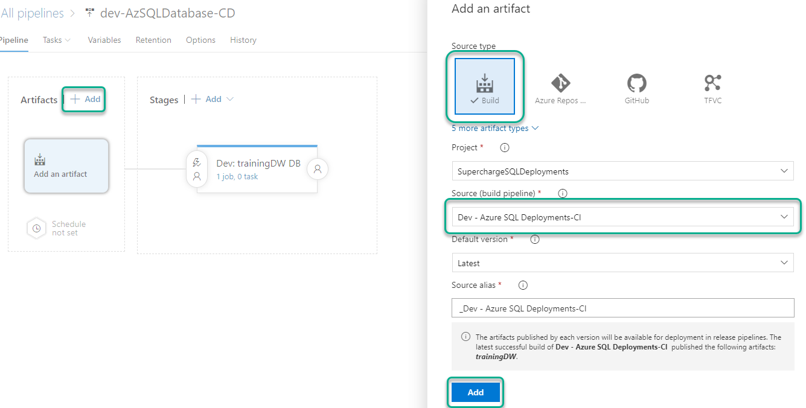

11. Click on the **Lighting bolt** icon to configure Continuous deployment
    1.  Set to **Enabled**
    2.  Add Build branch filterers:
        -  Type: **Include**
        -  Build branch: **dev**
        -  Click on **X** to close CD trigger
        
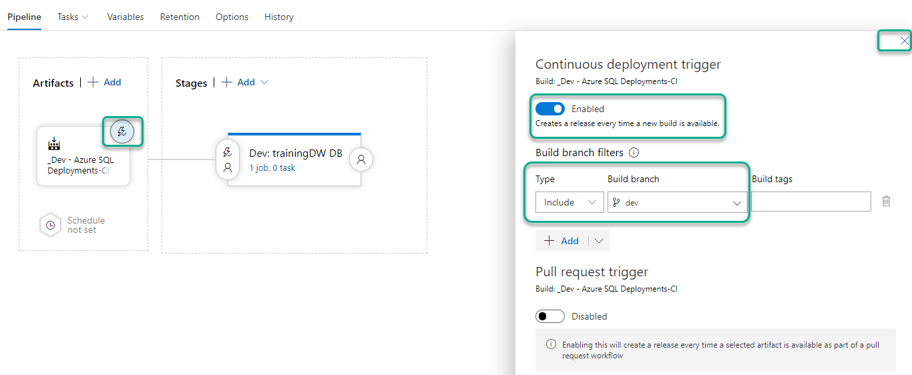

12. Click on the **1 job 0 task** and then the **Tasks** tab
13. Click the **+** icon next to Agent job  

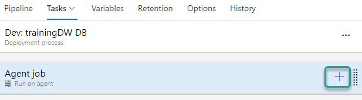

14. Search for **Azure Sql Database**
15. Click **Add** from the **Azure SQL Database deployment** task
    
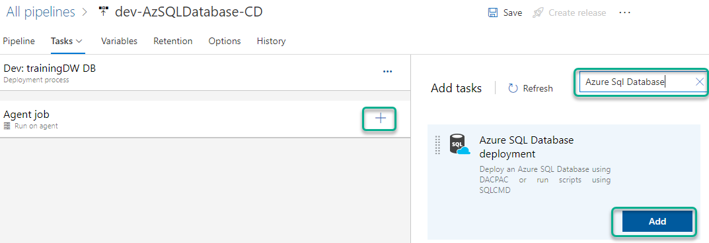

### Configure Azure SQL DacpacTask

1. Click on your newly added Azure SQL to configure
2. Display name: **Azure SQL Deployment Report**
3. Azure Subscription: **Your service Connection**
4. Azure SQL Server:

     ``` 
    "$(sql.serverName)-$(rEnv).$(endpoint)" 
     ```
5. Database: **trainingDW**
6. Login: **$(SQLadminLogin)**
7. Password: **$(SQLadminPass)**

:exclamation: Note the the SQL auth credentials are populdate form the linked Key Vault Values. This keeps your credentials from being exposed.

8. Deployment type: **SQL DACPAC File**
9. Action: **Deploy Report**

:bulb: Note that you are creating a deployment report with this task.  **Deploy Report** creates an XML report of the changes that would be made by a publish action. This can be used for change tracking, deployment approval, ect.

10. DACPAC File:

     ``` 
    $(System.DefaultWorkingDirectory)/_Dev - Azure SQL Deployments-CI/trainingDW/trainingDW/trainingDW/bin/Release/trainingDW.dacpac
     ```
11. Click **Save** > (Comment optional) > **Save**
12. Settings should look similar to this:

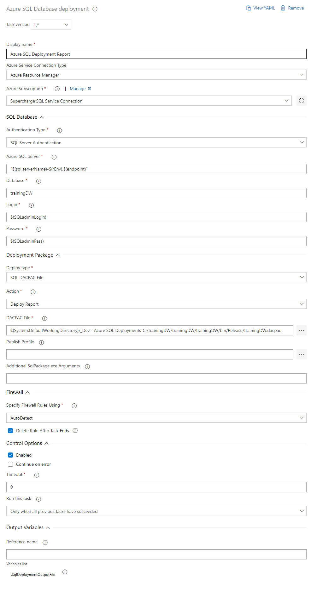

14. Right click on **Azure SQL Deployment Report** task > Select **Clone task(s)**

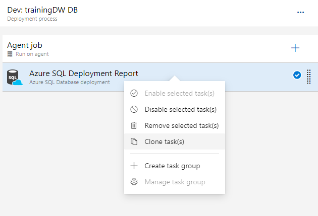

15. Click on the newly cloned task **Azure SQL Deployment Report copy** and update the following settings:
    1.  Display name: **Azure SQL Schema change script**
    2.  Action: **Script**

:bulb: Note that action type of **Script** creates the SQL script of all changes that will be deployed.  This can be treated like a schema compare script for your logs, change tracking, approval flows, ect..

14. Right click on the **Azure SQL Schema change script** task > Select **Clone task(s)**
15. Click on the newly cloned task **Azure SQL Schema change script copy** and update the following settings:
    1.  Display name: **Azure SQL DB deployment**
    2.  Action: **Publish**

:bulb: Note that action type of **Publish** updates the target database to match the schema of the source .dacpac file generated from your build (CI) pipeline. 

16. Click **Save** > (Comment optional) > **Save**

**Your pipeline tasks should look similar to this:**

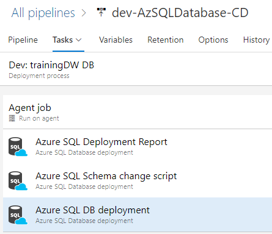

17. Click on the **Variables** tab of your pipeline
18. Click **+ Add** 
    -  Name: **rEnv**
    -  Value: **dev**
    -  Scope: **Release**
19. Click **+ Add** 
    -  Name: **endpoint**
    -  Value: **database.windows.net**
       -  *If your SQL logical server is in Azure Gov use: **database.usgovcloudapi.net***
    -  Scope: **Release**
   
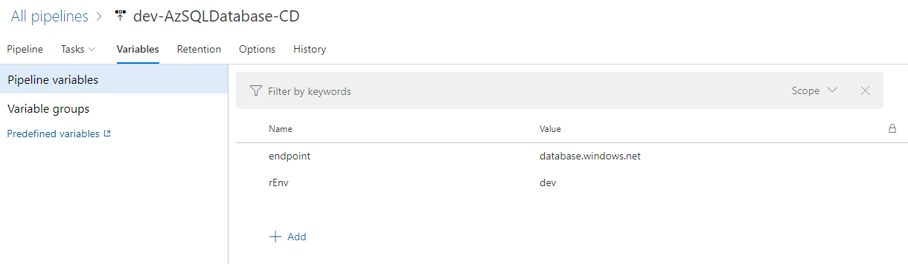

1.  Click on **Variable groups**
    1. Click on **Link variable group**
    2. Select: **SuperchargeSQL-KeyVaultpdev**
    3. Click the **Link** button
    4. Click on **Link variable group** again
    5. Select: **SuperchargeSQL-Vars**
    6. Click the **Link** button

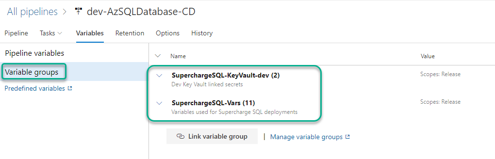

20. Click **Save** > (Comment optional) > **Save**
21. CLick on the **Pipeline** tab, your pipeline should look similar to:

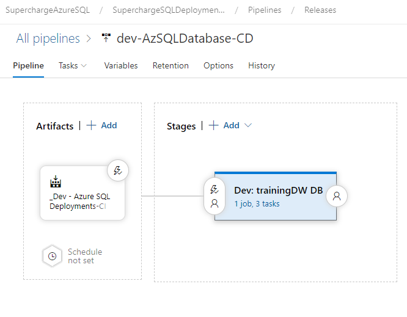

:exclamation: At this point you have a fully configured release pipeline for your **development** work. 

1. Using the skills you have learned to this point perform the following:
   1. Manually create a release from Azure DevOps
   2. Review all logs from the release
      1. You will need to **Download all logs** to review
   3. Spend some time looking at the Deployment Report (trainingDW_DeployReport.xml)
      1. You will need to **Download all logs** to review
   4. Spend some time reviewing schema change script (trainingDW_Script.sql)

### Challenge - Firewall rule

If you try to connect to your SQL Database with SSMS or Azure Data Studio using AAD auth, you will notice that there is no firewall rule configured.

1. Try to connect to your SQL Database using SSMS or Azure Data Studio
   1. Using your AAD account
2. Do not create the firewall rule when asked > click **Cancel**

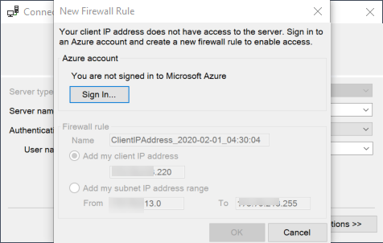

**Create a new firewall rule, no cheating with the portal**

1. Create a firewall rule by updating file: **sql_db.parameters.dev.json**
   1. To find your current IP in a browser navigate to:  http://ifconfig.me/ip 

2. Commit your changes and sync or push them up your Azure DevOps dev branch
3. Review your dev Build and dev release pipelines 
   1. Notice the build pipeline ran right after pushing your changes to your dev branch 
   2. Your release should be triggered, once the build pipeline completes
4. Connect using SSMS or Azure Data Studio
   1. You should now be able to connect

## <div style="color: #107c10">Exercise - Postdeployment Script (CI)</div>

With SSDT DB projects you can make use of **predeployment** and **postdeployment** scripts. This is very useful if you need to move data around before and after schema changes.  You can also use this type of process for your *DataOps* processes  

1. Inside of your Visual Studio SSDT project
2. From the Solution Explorer, right click **Scripts** folder
3. Click **Add** > **Script...**
4. Select **Post-Deployment Script**
   1. Name: **postLoad-dimDate.sql**
   2. CLick **Add**
5. Add the following to the script, right below the comments:

    ```SQL
    TRUNCATE TABLE [DIM].[DATE]
    GO

    ```
6. Open **LoadDateDim.sql**
7. Copy contents of file and paste it below your *TRUNCATE* statement

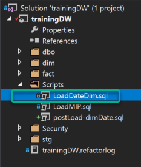

 - postLoad-dimDate.sql should look like this:
  
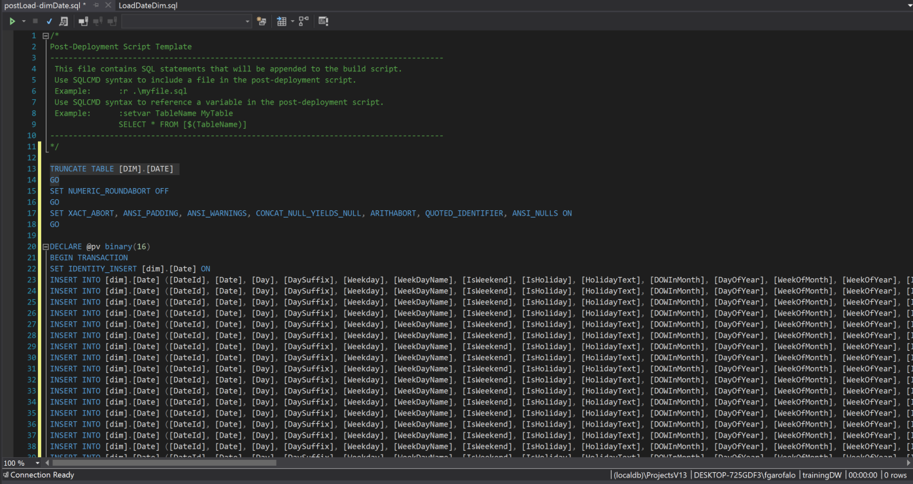

1. Save and close file: **Post-Deployment Script**
2. Close the **LoadDateDim.sql** file
3. In SSMS or Azure Data Studio query **dim.Date** notice no values are returned
4. Back in your Visual Studio SSDT project 
5. Click on the **pencil** icon on the bottom of SSDT (Visual Studio)


13. Click the **+** icon next to **Changes** to stage all changes
    - If prompted to Save changes click **Yes**

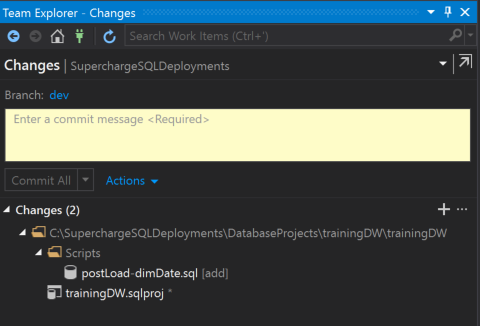

14. Enter commit: **post load script**
15. Click **Commit Staged** button

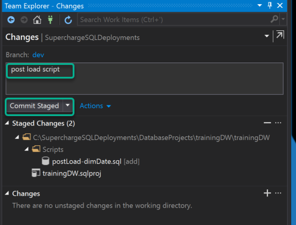

16. Click **Sync**

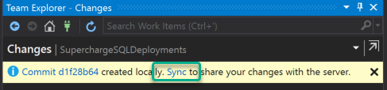

17. Click **Push** under **Outgoing Commits** 

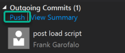

18. Navigate to your Azure DevOps project
19. Review your CI/CD pipelines checking status and logs
20. Once completed query **dim.Date** again
21. You should now have values in **dim.Date**

At this point you now have a fulling working CI/CD pipeline for database development.  

## <div style="color: #107c10">Exercise - Configure prod CI/CD - Challenge</div>

Using all your new skills learned in this workshop, create and configure the following:

1. Create & configure a prod build pipeline (CI) for your SSDT Project
   1. using your **master** branch
2. Create & configure a prod release pipeline (CD)
   1. Include both: **dev** & **prod** stages
   2. Add an approval gate after the **dev** stage before the **prod** stage. (You need to approve prod before it processes)
   3. use your **master** branch
   4. it should be triggered from a **pull request** dev to prod
3. Review the status and logs of your prod pipeline
4. Verify schema changes made it all they way through to prod Azure SQL DB

:bulb: Use the past labs and your already built pipelines for reference if you get stuck.

### Congratulations you have completed Supercharge your Azure SQL deployments by operationalizing Azure with DevOps
___     
- [Home](/README.md)
- [Back to all modules](/docs/labs/README.md)
___
___
