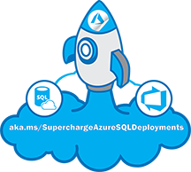

 
### **Supercharge your Azure SQL deployments by operationalizing Azure with DevOps**

##  Workshop Modules
- [1. Configure your Local Environment](/docs/labs/1-ConfigLocalEnvironment.md)
   - [1.1. Azure PowerShell](/docs/labs/1-ConfigLocalEnvironment.md#exercise---setup-az-powershell-module)
   - [1.2. Setup Git for Windows](/docs/labs/1-ConfigLocalEnvironment.md#exercise---setup--git-for-windows)   
   - [1.3 Setup Visual Studio Code](/docs/labs/1-ConfigLocalEnvironment.md#exercise---setup--visual-studio-code)   
   - [1.4 Visual Studio - SSDT](/docs/labs/1-ConfigLocalEnvironment.md#exercise---setup--visual-studio---ssdt)   
   - [1.5 SSMS (optional)](/docs/labs/1-ConfigLocalEnvironment.md#-exercise---setup-sql-server-management-studio-ssms-)
   - [1.6 Azure Data Studio (optional)](/docs/labs/1-ConfigLocalEnvironment.md#-exercise---setup--azure-data-studio-)
   - [1.7 Install sqlpackage for Windows](/docs/labs/1-ConfigLocalEnvironment.md#-exercise---install-sqlpackage-for-windows)
   - [1.8 Version Check and Configuration](/docs/labs/1-ConfigLocalEnvironment.md#exercise---version-check-and-configuration)

- [2. Configure your DevOps Environment](/docs/labs/2-Configure_your_DevOps_Environment.md)
   - [2.1. Azure Resource groups](/docs/labs/2-Configure_your_DevOps_Environment.md#create-azure-resource-groups)
   - [2.2. Azure AD Service Principles](/docs/labs/2-Configure_your_DevOps_Environment.md#create-service-principal)
   - [2.3. Access Control (IAM)](/docs/labs/2-Configure_your_DevOps_Environment.md#access-control-iam-for-the-resource-group)
   - [2.4. Azure DevOps Organizations](/docs/labs/2-Configure_your_DevOps_Environment.md#azure-devops-organizations)
   - [2.5. Azure DevOps Project](/docs/labs/2-Configure_your_DevOps_Environment.md#azure-devops-project---clone-project-repo)
   - [2.7. Branching](/docs/labs/2-Configure_your_DevOps_Environment.md#branching)
   - [2.8. DevOps Service connections - Azure Resource Manager](/docs/labs/2-Configure_your_DevOps_Environment.md#devops-service-connection-with-azure-resource-manager)
   - [2.9. Push files to Repository](/docs/labs/2-Configure_your_DevOps_Environment.md#exercise---push-files-to-your-repo)
   - [2.10. Performing your initial Commit using VS Code](/docs/labs/2-Configure_your_DevOps_Environment.md#performing-your-inital-commit-using-vs-code)

- [3. Advanced ARM template](/docs/labs/3-AzureResourceDeployment.md#exercise---advanced-arm-template)
  - [3.1. Build pipeline (CI)](/docs/labs/3-AzureResourceDeployment.md#exercise---build-pipeline-ci)
    - [3.1.1 Configure the continuos integration](/docs/labs/3-AzureResourceDeployment.md#configure-the-continuos-integration-on-the-build-pipeline)
    - [3.1.2 Testing Azure resource CI pipeline](/docs/labs/3-AzureResourceDeployment.md#testing-azure-resource-ci-pipeline)
  - [3.2 Build release pipeline (CD)](/docs/labs/3-AzureResourceDeployment.md#exercise---release-pipeline-cd)
     - [3.2.1 Configure Key Vault deployment task](/docs/labs/3-AzureResourceDeployment.md#configure-key-vault-deployment-task)
     - [3.2.2 Configure SQL DB deployment task](/docs/labs/3-AzureResourceDeployment.md#configure-sql-db-deployment-task)
     - [3.2.3 Configure PowerShell task](/docs/labs/3-AzureResourceDeployment.md#configure-powershell-task)
     - [3.2.4 Configure Azure PowerShell task](/docs/labs/3-AzureResourceDeployment.md#configure-azure-powershell-task)
     - [3.2.5 Configure prod CI/CD pipelines](/docs/labs/3-AzureResourceDeployment.md#exercise---configure-prod-cicd-pipelines)
     - [3.2.6 Create & configure Prod build pipeline (CI)](/docs/labs/3-AzureResourceDeployment.md#create--configure-prod-build-pipeline-ci)
     - [3.2.7 Create & configure Prod release pipeline (CD)](/docs/labs/3-AzureResourceDeployment.md#create--configure-prod-release-pipeline-cd)
  - [3.3 Pull request](/docs/labs/3-AzureResourceDeployment.md#exercise---pull-request)
    - [3.3.1 Review Prod CI/CD](/docs/labs/3-AzureResourceDeployment.md#review-prod-cicd)

- [4. Database life cycle Management](/docs/labs/4-DatabaseLifecycleManagement.md)
   - [4.1 Initial SSDT project setup](/docs/labs/4-DatabaseLifecycleManagement.md#initial-ssdt-project-setup)
   - [4.2 Get to know SSDT database projects](/docs/labs/4-DatabaseLifecycleManagement.md#get-to-know-ssdt-database-projects)
   - [4.3 Build your database project](/docs/labs/4-DatabaseLifecycleManagement.md#build-your-database-project)
   - [4.4 Load data your local DB](/docs/labs/4-DatabaseLifecycleManagement.md#load-data-your-local-db)
   - [Dev Database Build Pipeline (CI)](/docs/labs/4-DatabaseLifecycleManagement.md#exercise---dev-database-build-pipeline-ci)
   - Dev Database Release Pipeline (CD)
   - Unit Testing
   - Dev, Test, Prod Pipeline
